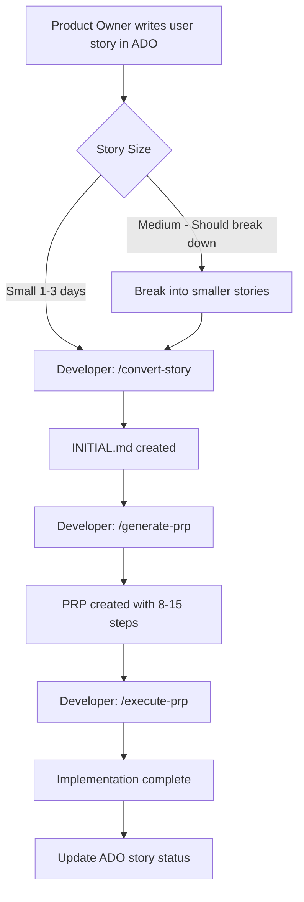

# [[CODEBASE_NAME]] - Architecture & Planning

> **How to Use This File:**
> - **Stable Sections** (marked with `[STABLE]`) describe your codebase/repository - update rarely
> - **Initiative Sections** (marked with `[INITIATIVE]`) describe current product project - update per initiative
> - When starting a new product project, update only the `[INITIATIVE]` sections

---

## [STABLE] Codebase Overview

**Repository:** [[REPO_NAME]]
**Primary Language:** [[LANGUAGE]]
**Framework:** [[FRAMEWORK]]

### Purpose
[[ONE_SENTENCE_DESCRIPTION_OF_WHAT_THIS_CODEBASE_IS_FOR]]

### Repositories in Scope
<!-- If monorepo, list packages. If multi-repo, list related repos -->
- [[REPO_OR_PACKAGE_1]]: [[PURPOSE]]
- [[REPO_OR_PACKAGE_2]]: [[PURPOSE]]

---

## [STABLE] System Architecture

```mermaid
graph TD
    A[[[COMPONENT_1]]] --> B[[[COMPONENT_2]]]
    A --> C[[[COMPONENT_3]]]
    B --> D[[[COMPONENT_4]]]
    C --> D
    D --> E[[[COMPONENT_5]]]
```

### Key Components
| Component | Responsibility | Location |
|-----------|---------------|----------|
| [[COMPONENT_1]] | [[RESPONSIBILITY]] | `src/[[PATH]]` |
| [[COMPONENT_2]] | [[RESPONSIBILITY]] | `src/[[PATH]]` |
| [[COMPONENT_3]] | [[RESPONSIBILITY]] | `src/[[PATH]]` |

---

## [STABLE] Data Flow

1. **[[STEP_1]]** → [[STEP_2]]
2. **[[STEP_2]]** → [[STEP_3]]
3. **[[STEP_3]]** → [[STEP_4]]
4. **[[STEP_4]]** → [[STEP_5]]

---

## [STABLE] State Management Strategy

**[[STATE_SOLUTION_1]] ([[USE_CASE]]):**
- [[WHAT_DATA_GOES_HERE]]
- [[WHY_THIS_SOLUTION]]

**[[STATE_SOLUTION_2]] ([[USE_CASE]]):**
- [[WHAT_DATA_GOES_HERE]]
- [[WHY_THIS_SOLUTION]]

**[[PERSISTENCE]] (if applicable):**
- [[WHAT_GETS_PERSISTED]]
- [[WHERE_AND_HOW]]

---

## [STABLE] API Integration

**API Specification Reference** (if applicable):
- **Full spec:** `docs/api/[[YOUR_API_NAME]]-spec.json`
- **AI summary:** `PRPs/ai_docs/[[your_api]]-spec-summary.md`
- **Live endpoints:** [[API_BASE_URLS]]

**Authentication Flow:**
```
[[DESCRIBE_AUTH_FLOW_OR_ADD_MERMAID_DIAGRAM]]
```

**Data Fetching Strategy:**
- [[STRATEGY_ELEMENT_1]]
- [[STRATEGY_ELEMENT_2]]
- [[STRATEGY_ELEMENT_3]]

---

## [STABLE] Security Architecture

**[[SECURITY_CONCERN_1]]:**
- [[IMPLEMENTATION_APPROACH]]

**[[SECURITY_CONCERN_2]]:**
- [[IMPLEMENTATION_APPROACH]]

**[[SECURITY_CONCERN_3]]:**
- [[IMPLEMENTATION_APPROACH]]

---

## [STABLE] Tech Stack

| Technology | Purpose | Why Chosen |
|------------|---------|------------|
| [[TECH_1]] | [[PURPOSE]] | [[JUSTIFICATION]] |
| [[TECH_2]] | [[PURPOSE]] | [[JUSTIFICATION]] |
| [[TECH_3]] | [[PURPOSE]] | [[JUSTIFICATION]] |
| [[TECH_4]] | [[PURPOSE]] | [[JUSTIFICATION]] |
| [[TECH_5]] | [[PURPOSE]] | [[JUSTIFICATION]] |

---

## [STABLE] Non-Functional Requirements

**Performance Targets:**
- [[METRIC_1]]: [[TARGET]]
- [[METRIC_2]]: [[TARGET]]
- [[METRIC_3]]: [[TARGET]]

**[[OTHER_NFR_CATEGORY]]:**
- [[REQUIREMENT_1]]
- [[REQUIREMENT_2]]

---

# ═══════════════════════════════════════════════════════════════
# INITIATIVE SECTIONS - Update these per product project
# ═══════════════════════════════════════════════════════════════

## [INITIATIVE] Current Product Project

**Initiative Name:** [[INITIATIVE_NAME]]
**Started:** [[DATE]]
**Target Completion:** [[DATE_OR_SPRINT]]
**ADO Epic/Feature ID:** [[ADO_ID]] (if applicable)

### Project Goal
[[ONE_SENTENCE_DESCRIPTION_OF_WHAT_YOU_ARE_BUILDING_AND_WHY]]

### Target Users
- [[USER_PERSONA_1_WITH_BRIEF_DESCRIPTION]]
- [[USER_PERSONA_2]]
- [[USER_PERSONA_3]]

---

## [INITIATIVE] Feature Hierarchy (Priority Order)

1. **PRIMARY**: [[FEATURE_1]] ([[PERCENTAGE]]% of effort)
   - [[SUB_FEATURE_A]]
   - [[SUB_FEATURE_B]]
   - [[SUB_FEATURE_C]]

2. **SECONDARY**: [[FEATURE_2]] ([[PERCENTAGE]]% of effort)
   - [[SUB_FEATURE_A]]
   - [[SUB_FEATURE_B]]

3. **TERTIARY**: [[FEATURE_3]] ([[PERCENTAGE]]% of effort - OPTIONAL)
   - [[SUB_FEATURE_A]]

---

## [INITIATIVE] Success Criteria

<!-- What does "done" look like for this initiative? -->

- [ ] [[SPECIFIC_MEASURABLE_CRITERION_1]]
- [ ] [[SPECIFIC_MEASURABLE_CRITERION_2]]
- [ ] [[SPECIFIC_MEASURABLE_CRITERION_3]]
- [ ] [[SPECIFIC_MEASURABLE_CRITERION_4]]
- [ ] [[SPECIFIC_MEASURABLE_CRITERION_5]]

---

## [INITIATIVE] Key Decisions & Constraints

<!-- Capture important decisions specific to this initiative -->

| Decision | Rationale | Date |
|----------|-----------|------|
| [[DECISION_1]] | [[WHY]] | [[DATE]] |
| [[DECISION_2]] | [[WHY]] | [[DATE]] |

**Constraints:**
- [[CONSTRAINT_1]]
- [[CONSTRAINT_2]]

---

## [INITIATIVE] Dependencies & Risks

**Dependencies:**
- [[DEPENDENCY_1]]: [[STATUS]]
- [[DEPENDENCY_2]]: [[STATUS]]

**Risks:**
| Risk | Likelihood | Impact | Mitigation |
|------|------------|--------|------------|
| [[RISK_1]] | [[H/M/L]] | [[H/M/L]] | [[MITIGATION]] |
| [[RISK_2]] | [[H/M/L]] | [[H/M/L]] | [[MITIGATION]] |

---

# ═══════════════════════════════════════════════════════════════
# REFERENCE: Work Granularity (from original PLANNING.md)
# ═══════════════════════════════════════════════════════════════

## Work Granularity & Agile Mapping

| Level | ADO/Jira Item | Context Engineering Mapping | Typical Size |
|-------|---------------|----------------------------|--------------|
| **Epic** | Epic | Entry in TASK.md + Feature Task File | Multiple weeks |
| **Feature** | Feature | Feature Task File with 3-10 subtasks | 1-2 weeks |
| **Story** | User Story | 1 INITIAL.md → 1 PRP | 1-3 days |

### Workflow



---

# ═══════════════════════════════════════════════════════════════
# ARCHIVE: Previous Initiatives (Optional - move completed here)
# ═══════════════════════════════════════════════════════════════

<!--
When an initiative completes, you can optionally archive key details here
for historical reference, or delete this section if not needed.

## [ARCHIVED] Initiative Name (Completed: DATE)
- Goal: ...
- Outcome: ...
- Key learnings: ...
-->
