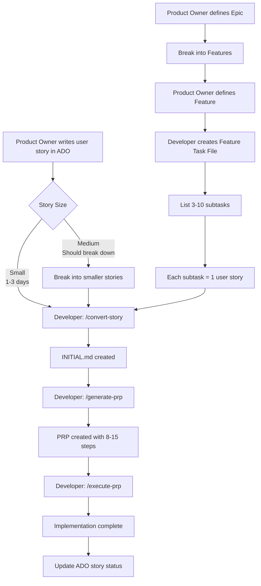

# [[PROJECT_NAME]] - Architecture & Goals

## Project Goal

[[ONE_SENTENCE_DESCRIPTION_OF_WHAT_YOU_ARE_BUILDING_AND_WHY]]

## Target Users

- [[USER_PERSONA_1_WITH_BRIEF_DESCRIPTION]]
- [[USER_PERSONA_2]]
- [[USER_PERSONA_3]]

## Feature Hierarchy (Priority Order)

1. **PRIMARY**: [[FEATURE_1]] ([[PERCENTAGE]]% of effort)
   - [[SUB_FEATURE_A]]
   - [[SUB_FEATURE_B]]
   - [[SUB_FEATURE_C]]

2. **SECONDARY**: [[FEATURE_2]] ([[PERCENTAGE]]% of effort)
   - [[SUB_FEATURE_A]]
   - [[SUB_FEATURE_B]]

3. **TERTIARY**: [[FEATURE_3]] ([[PERCENTAGE]]% of effort - OPTIONAL)
   - [[SUB_FEATURE_A]]

## Work Granularity & Product Owner Integration

### Three Levels of Work

Context Engineering supports work at three granularity levels, matching traditional Agile/Scrum hierarchy:

| Level | ADO/Jira Item | Context Engineering Mapping | Typical Size | Developer Flow |
|-------|---------------|----------------------------|--------------|----------------|
| **Epic** | Epic | Master Task (TASK-XXX) in `.claude/TASK.md` | Multiple weeks | Break into Features |
| **Feature** | Feature | Feature Task File `.claude/tasks/TASK-XXX-name.md` | 1-2 weeks | Break into Stories, 3-10 subtasks |
| **Story** | User Story | 1 INITIAL.md → 1 PRP | 1-3 days | `/convert-story` → `/generate-prp` → `/execute-prp` |

### Story Level (Most Common)

**Typical Flow:**
1. Product Owner writes user story in Azure DevOps/Jira
2. Developer runs `/convert-story` to create INITIAL.md
3. Developer runs `/generate-prp` to create PRP
4. Developer runs `/execute-prp` to implement
5. Developer updates ADO/Jira status

**Characteristics:**
- 1-3 days of work (3-8 story points)
- Single focused capability
- Independently deployable
- Has clear acceptance criteria
- Maps 1:1 to a PRP

**Example:**
- ADO Story: "As a mobile user, I want to login with email/password"
- Creates: `PRPs/feature-requests/US-4523-user-login-INITIAL.md`
- Generates: `PRPs/active/US-4523-user-login-PRP.md`
- Result: Single PRP, 8-15 implementation steps, 2-4 hours execution time

### Feature Level

**Typical Flow:**
1. Product Owner writes multiple related user stories
2. Developer creates master task in `.claude/TASK.md`
3. Developer creates feature task file in `.claude/tasks/`
4. Each story becomes a subtask with its own PRP
5. Feature completes when all subtasks/PRPs complete

**Characteristics:**
- 1-2 weeks of work (10-20 story points)
- Multiple related capabilities
- 3-10 user stories grouped together
- Feature ships when all stories complete

**Example:**
- ADO Feature: "User Authentication"
- User Stories: Login (US-4523), Logout (US-4524), Token Refresh (US-4525), Password Reset (US-4526)
- Creates: `[TASK-005] User Authentication (0/4)` in TASK.md
- Creates: `.claude/tasks/TASK-005-user-authentication.md` with 4 subtasks
- Each subtask → separate PRP
- Result: 4 PRPs, implemented over 1-2 weeks

### Epic Level

**Typical Flow:**
1. Product Owner defines large initiative
2. Break epic into features
3. Break each feature into stories
4. Implement stories incrementally across multiple sprints

**Characteristics:**
- Multiple weeks (30+ story points)
- Multiple features
- Spans multiple sprints
- No direct PRP mapping (break down first)

**Example:**
- ADO Epic: "User Management System"
- Features: Authentication (4 stories), User Profiles (5 stories), Permissions (3 stories), Audit Log (2 stories)
- Creates: Multiple master tasks (TASK-005, TASK-006, TASK-007, TASK-008)
- Each feature → Multiple PRPs
- Result: 14 PRPs total, implemented over 4-6 sprints

### Workflow Diagram



### Product Owner Best Practices

**For optimal Context Engineering workflow:**

1. **Write small stories** (1-3 days each)
   - Single focused capability
   - Clear acceptance criteria (Given/When/Then)
   - Independently valuable

2. **Group related stories into Features**
   - Logical grouping of 3-7 stories
   - Stories can be implemented in any order (minimal dependencies)
   - Feature represents cohesive capability

3. **Define Epics for large initiatives**
   - Group multiple features
   - Spans multiple sprints
   - Clear business objective

4. **Provide clear acceptance criteria**
   - Use Given/When/Then format
   - Each criterion is testable
   - Cover happy path and key error cases

**See `docs/optional/PRODUCT_OWNER_GUIDE.md` for complete Product Owner documentation.**

### Developer Best Practices

**Converting user stories:**
- Use `/convert-story` command for consistency
- Research codebase during conversion
- Ask clarifying questions before generating PRP
- Verify API endpoints match specification

**Managing features:**
- Create feature task files for related stories
- Link subtasks to user stories in ADO
- Update progress as PRPs complete
- Run `/validate-tasks` to auto-update parent tasks

**When to skip conversion:**
- Technical work (refactoring, bug fixes)
- Developer-initiated improvements
- Very technical features needing research first
- Just write INITIAL.md directly and proceed

## System Architecture

```mermaid
graph TD
    A[[[COMPONENT_1]]] --> B[[[COMPONENT_2]]]
    A --> C[[[COMPONENT_3]]]
    B --> D[[[COMPONENT_4]]]
    C --> D
    D --> E[[[COMPONENT_5]]]
```

## Data Flow

1. **[[STEP_1]]** → [[STEP_2]]
2. **[[STEP_2]]** → [[STEP_3]]
3. **[[STEP_3]]** → [[STEP_4]]
4. **[[STEP_4]]** → [[STEP_5]]

## State Management Strategy

**[[STATE_SOLUTION_1]] ([[USE_CASE]]):**
- [[WHAT_DATA_GOES_HERE]]
- [[WHY_THIS_SOLUTION]]

**[[STATE_SOLUTION_2]] ([[USE_CASE]]):**
- [[WHAT_DATA_GOES_HERE]]
- [[WHY_THIS_SOLUTION]]

**[[PERSISTENCE]] (if applicable):**
- [[WHAT_GETS_PERSISTED]]
- [[WHERE_AND_HOW]]

## API Integration

**API Specification Reference** (if applicable):
- **Full spec:** `docs/api/[[YOUR_API_NAME]]-spec.json`
- **AI summary:** `PRPs/ai_docs/[[your_api]]-spec-summary.md`
- **Live endpoints:** [[API_BASE_URLS]]

**Authentication Flow:**
```
[[DESCRIBE_AUTH_FLOW_OR_ADD_MERMAID_DIAGRAM]]
```

**Data Fetching Strategy:**
- [[STRATEGY_ELEMENT_1]]
- [[STRATEGY_ELEMENT_2]]
- [[STRATEGY_ELEMENT_3]]

## [[OPTIONAL_ARCHITECTURE_SECTION]]

**[[ASPECT_1]]:**
- [[IMPLEMENTATION_DETAIL_1]]
- [[IMPLEMENTATION_DETAIL_2]]

**[[ASPECT_2]]:**
- [[IMPLEMENTATION_DETAIL_1]]
- [[IMPLEMENTATION_DETAIL_2]]

## Security Architecture

**[[SECURITY_CONCERN_1]]:**
- [[IMPLEMENTATION_APPROACH]]

**[[SECURITY_CONCERN_2]]:**
- [[IMPLEMENTATION_APPROACH]]

**[[SECURITY_CONCERN_3]]:**
- [[IMPLEMENTATION_APPROACH]]

## Tech Stack Rationale

| Technology | Why |
|------------|-----|
| [[TECH_1]] | [[JUSTIFICATION]] |
| [[TECH_2]] | [[JUSTIFICATION]] |
| [[TECH_3]] | [[JUSTIFICATION]] |
| [[TECH_4]] | [[JUSTIFICATION]] |
| [[TECH_5]] | [[JUSTIFICATION]] |

## Non-Functional Requirements

**Performance Targets:**
- [[METRIC_1]]: [[TARGET]]
- [[METRIC_2]]: [[TARGET]]
- [[METRIC_3]]: [[TARGET]]

**[[OTHER_NFR_CATEGORY]]:**
- [[REQUIREMENT_1]]
- [[REQUIREMENT_2]]

**[[ANOTHER_NFR_CATEGORY]]:**
- [[REQUIREMENT_1]]
- [[REQUIREMENT_2]]

## Success Criteria [[FOR_PROJECT_OR_MILESTONE_OR_DEMO]]

- [ ] [[SPECIFIC_MEASURABLE_CRITERION_1]]
- [ ] [[SPECIFIC_MEASURABLE_CRITERION_2]]
- [ ] [[SPECIFIC_MEASURABLE_CRITERION_3]]
- [ ] [[SPECIFIC_MEASURABLE_CRITERION_4]]
- [ ] [[SPECIFIC_MEASURABLE_CRITERION_5]]
