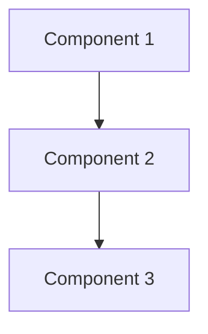
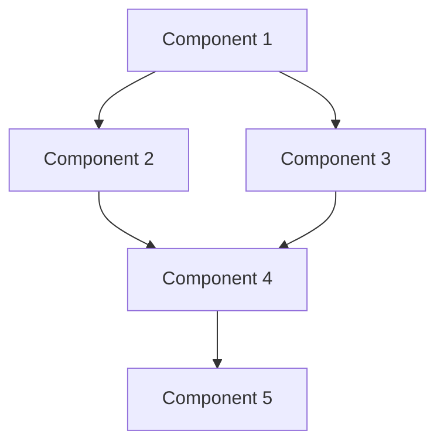

# Context Engineering Reusability Guide

> **NOTE:** This repository IS the universal Context Engineering template. This guide was originally written to explain how to extract reusable patterns from the EZMobile implementation. The extraction is now complete - this IS the template. Use this guide as reference documentation for understanding the system architecture and patterns.
>
> **For setup instructions:** See [SETUP_GUIDE.md](SETUP_GUIDE.md)
>
> **For customization:** See [CUSTOMIZATION_GUIDE.md](CUSTOMIZATION_GUIDE.md)

---

## Executive Summary

This guide documents the **Context Engineering System**, a proven approach for enabling AI coding assistants to achieve "one-pass implementation success" through comprehensive upfront context. Originally developed for the EZMobile project and now genericized as a universal template.

**Key Results (from EZMobile implementation):**
- 10x better context than prompt engineering alone
- 100x better than "vibe coding"
- 70%+ first-pass success rate on complex features
- Minimal clarification questions (1-2 average)
- Consistent code quality across all implementations

**Time Investment:**
- Initial setup: 16-20 hours
- ROI: 50-70% reduction in feature development time
- Payback: After ~3 medium-sized features

---

## What Is Context Engineering?

**Context Engineering** = Providing AI with everything it needs upfront:
1. **Comprehensive documentation** (conventions, architecture, gotchas)
2. **Working code examples** (not descriptions, actual working code)
3. **Validation loops** (automated testing at each step)
4. **Step-by-step blueprints** (PRPs with implementation guidance)

**The Insight:** Most AI failures aren't model failures—they're context failures. Give AI complete context, and it succeeds.

---

## EZMobile System Overview

The EZMobile context engineering system consists of **41+ files** across **4 main directories**:

```
Project/
├── .claude/                    # AI context & commands (17 files)
│   ├── CLAUDE.md              # Global conventions (what/how/why)
│   ├── PLANNING.md            # Architecture & goals
│   ├── TASK.md                # Project-level task tracking
│   ├── INITIAL.md             # Feature request template
│   └── commands/              # 12 slash commands (workflows)
├── PRPs/                       # Product Requirement Prompts
│   ├── ai_docs/               # Library documentation (AI-optimized)
│   ├── templates/             # PRP templates
│   ├── scripts/               # Automation scripts
│   └── completed/             # Archived PRPs
├── examples/                   # Working code patterns (CRITICAL)
│   ├── integrations/          # API clients, data fetching
│   ├── components/            # UI components
│   ├── hooks/                 # Custom hooks
│   ├── state/                 # State management
│   ├── security/              # Auth, audit logging
│   ├── offline/               # Offline patterns (optional)
│   └── testing/               # Test patterns
└── docs/                       # Project documentation
    ├── api/                   # API specifications
    └── [other docs]
```

---

## Reusability Matrix

### 🌍 UNIVERSAL (Copy directly, minimal changes)

These components work in ANY project with minimal adaptation:

#### 1. Slash Commands (12 files)
**Location:** `.claude/commands/*.md`

| Command | Purpose | Adaptation |
|---------|---------|------------|
| `generate-prp.md` | Generate PRPs from feature requests | Update file paths |
| `execute-prp.md` | Execute PRPs with ULTRATHINK planning | Update validation commands |
| `prime-core.md` | Load all project context into memory | Update file paths |
| `validate-context.md` | Validate context completeness | None needed |
| `review-general.md` | Comprehensive code review | None needed |
| `review-staged.md` | Review staged git changes | None needed |
| `refactor-simple.md` | Refactoring workflow | None needed |
| `create-pr.md` | Generate PR descriptions | None needed |
| `onboarding.md` | Developer onboarding guide | None needed |
| `debug.md` | Systematic debugging workflow | None needed |
| `planning-create.md` | Create planning documents | None needed |
| `archive-prp.md` | Archive completed PRPs | Update file paths |

**Key Innovation:** Frontmatter with `description:` field for Claude Code integration

**Copy Strategy:**
1. Copy entire `.claude/commands/` directory
2. Find/replace `.claude/CLAUDE.md` → your project path
3. Find/replace `examples/` → your project path
4. Update validation commands (e.g., `npm run type-check` → project-specific)

---

#### 2. Feature Request Template
**Location:** `.claude/INITIAL.md`

**Structure:**
```markdown
## FEATURE
[Specific functionality to implement]

## EXAMPLES
[Code examples, screenshots, links]

## DOCUMENTATION
[Links to docs, APIs, libraries]

## OTHER CONSIDERATIONS
[Gotchas, requirements, constraints]
```

**Adaptation:** None needed (100% reusable)

---

#### 3. Task Tracking
**Location:** `.claude/TASK.md`

**Format:**
```markdown
## In Progress
- [ ] Current task

## Pending
- [ ] Future tasks

## Completed
- [x] Done tasks
```

**Adaptation:** None needed (100% reusable)

---

#### 4. Settings Configuration
**Location:** `.claude/settings.local.json`

```json
{
  "permissions": {
    "allow": ["Bash(find:*)"],
    "deny": [],
    "ask": []
  }
}
```

**Adaptation:** Add project-specific permissions

---

### 🔧 ADAPTABLE (Keep structure, customize content)

These components require significant customization but the structure is proven:

#### 1. Global Conventions (CLAUDE.md)
**Location:** `.claude/CLAUDE.md` (301 lines in EZMobile)

**Section Structure (100% reusable):**

```markdown
# [Project Name] - Global Conventions

## Project Context (Auto-Loaded)
@.claude/PLANNING.md
@.claude/TASK.md

## Project Awareness
**Before starting ANY work:**
- Review [key directories]
- Consult [key documentation]
- Verify [critical requirements]

## Code Structure
**File Organization:** [patterns]
**Naming Conventions:** [rules]
**Import Order:** [rules]

## Tech Stack Patterns
**[Library 1]:** [patterns with examples]
**[Library 2]:** [patterns with examples]

## Testing Requirements
**Test Coverage:** [requirements]
**Test Structure:** [example]
**Test Patterns:** [by type]

## Security Rules (CRITICAL)
**[Security Area 1]:** [rules]
**[Security Area 2]:** [rules]

## [Optional: Offline-First Architecture]
## [Optional: Other Architecture Patterns]

## Style & Formatting
**Code Style:** [rules]
**Comments:** [philosophy]

## Documentation Requirements
**When to Update Docs:** [triggers]

## Task Management
**Three-Level Task System:**
- Master TASK.md: Epic/feature level with task IDs
- Feature Task Files (.claude/tasks/): Persistent subtasks
- TodoWrite: Session-level, temporary
- Run `/validate-tasks` to auto-update progress

## Validation Commands (Must Pass Before Committing)
```bash
[your validation commands]
```

## Critical Gotchas
**[Technology 1]:**
- [gotcha 1]
- [gotcha 2]

## Never Do This
❌ [bad practice 1]
❌ [bad practice 2]

## Always Do This
✅ [good practice 1]
✅ [good practice 2]
```

**What to Adapt:**
- Tech stack specifics (React Native → Next.js/Django/etc.)
- Validation commands (match your package.json scripts)
- Security rules (project-specific auth/storage patterns)
- File organization patterns
- Library-specific gotchas

**What to Keep:**
- Section structure
- Two-level task system (TASK.md + TodoWrite)
- Import order concept
- Comment philosophy (WHY not WHAT)
- Never/Always sections for quick reference

**EZMobile Example Sections You Can Adapt:**
- React Native + Expo patterns → Your mobile framework
- Tamagui Components → Your UI library
- React Query patterns → Your data fetching library
- Zustand patterns → Your state management
- expo-secure-store rules → Your auth storage

---

#### 2. Architecture Planning (PLANNING.md)
**Location:** `.claude/PLANNING.md` (136 lines in EZMobile)

**Section Structure (100% reusable):**

```markdown
# [Project Name] - Architecture & Goals

## Project Goal
[One sentence: What are we building and why?]

## Target Users
- [User persona 1]
- [User persona 2]

## Feature Hierarchy (Priority Order)
1. **PRIMARY**: [Feature 1] (X% of effort)
   - [Sub-feature A]
   - [Sub-feature B]
2. **SECONDARY**: [Feature 2] (Y% of effort)
3. **TERTIARY**: [Feature 3] (Z% of effort - OPTIONAL)

## System Architecture


## Data Flow
1. **User Action** → [flow step 1]
2. **[Step 1]** → [flow step 2]
...

## State Management Strategy
**[State Library 1] (Server State):**
- [what goes here]

**[State Library 2] (Client State):**
- [what goes here]

**[Persistence]:**
- [what gets persisted]

## API Integration
**Authentication Flow:** [description or diagram]
**Data Fetching Strategy:** [patterns]

## [Optional: Offline-First Architecture]

## Security Architecture
**[Security Area 1]:** [implementation]
**[Security Area 2]:** [implementation]

## Tech Stack Rationale
| Technology | Why |
|------------|-----|
| [Tech 1] | [Reason] |
| [Tech 2] | [Reason] |

## Non-Functional Requirements
**Performance Targets:**
- [Target 1]
- [Target 2]

**[Other NFRs]:**
- [Requirement 1]

## Success Criteria [for Project/Demo/Milestone]
- [ ] [Criterion 1]
- [ ] [Criterion 2]
```

**What to Adapt:**
- All content (architecture, tech stack, features)
- Mermaid diagrams (match your architecture)

**What to Keep:**
- Section structure
- Mermaid for visual diagrams
- Tech stack rationale table (justify every choice)
- Success criteria as checkboxes
- Priority percentages for features

---

#### 3. Code Examples Library
**Location:** `examples/` (15 files in EZMobile)

**Directory Structure (100% reusable):**
```
examples/
├── integrations/          # API clients, data fetching patterns
├── components/            # UI component patterns
├── hooks/                 # Custom hook patterns
├── state/                 # State management patterns
├── security/              # Auth, audit logging patterns
├── [architecture]/        # E.g., offline/, realtime/, etc.
└── testing/               # Test patterns
```

**What Makes Examples Effective:**
1. **Complete working code** (not snippets or pseudocode)
2. **Inline comments** explaining WHY and gotchas
3. **Real project patterns** (not generic tutorials)
4. **Organized by type** (not by feature)
5. **Best practices built-in** (no bad patterns)

**Pattern Categories to Include:**

| Category | Example Files | Purpose |
|----------|---------------|---------|
| **integrations/** | `api-client.ts`, `data-fetching-hook.ts`, `mutation-pattern.ts` | How to call APIs |
| **components/** | `card-component.tsx`, `button-component.tsx`, `status-badge.tsx` | UI patterns |
| **hooks/** | `use-data-hook.ts`, `use-mutation-hook.ts` | Custom hook structure |
| **state/** | `feature-store.ts`, `auth-store.ts` | State management |
| **security/** | `token-manager.ts`, `audit-logger.ts` | Security patterns |
| **testing/** | `component.test.tsx`, `hook.test.ts` | Test structure |

**EZMobile Examples You Can Adapt:**

1. **`integrations/axios-client.ts`** → Generic API client pattern
   - Auth interceptor pattern
   - Error handling pattern
   - Token refresh pattern
   - Adapt to: fetch, Apollo, tRPC, etc.

2. **`integrations/react-query-hook.ts`** → Data fetching pattern
   - Cache key structure
   - Stale time configuration
   - Error handling
   - Adapt to: SWR, Apollo useQuery, custom hooks, etc.

3. **`integrations/mutation-optimistic.ts`** → Optimistic update pattern
   - Optimistic update flow
   - Rollback on error
   - Cache invalidation
   - Adapt to: Any mutation library

4. **`state/calendar-store.ts`** → State store with persistence
   - Store structure (state + actions)
   - Persistence middleware
   - Selector patterns
   - Adapt to: Redux, MobX, Jotai, Recoil, etc.

5. **`security/token-manager.ts`** → Auth token management
   - Token storage
   - Token refresh logic
   - Expiry checking
   - Adapt to: Any auth system (JWT, OAuth, etc.)

6. **`security/audit-logger.ts`** → Audit logging pattern
   - Event logging structure
   - Offline queue
   - Sensitive data handling
   - Universal pattern

7. **`offline/mutation-queue.ts`** → Offline mutation queue
   - Queue persistence
   - FIFO processing
   - Conflict resolution
   - Adapt to: Any offline-first app

8. **`testing/component.test.tsx`** → Component test structure
   - Arrange/Act/Assert pattern
   - Mock setup
   - Test organization
   - Adapt to: Any testing library

**How to Build Your Examples Library:**

1. **Start with core patterns** (API client, data fetching, state management)
2. **Add 2-3 examples per category** (minimum)
3. **Use real code from your project** (not made-up examples)
4. **Add comments generously** (explain WHY and gotchas)
5. **Keep examples focused** (one pattern per file)
6. **Ensure all examples work** (no broken code)
7. **Update as patterns evolve** (living documentation)

---

#### 4. Library Documentation
**Location:** `PRPs/ai_docs/` (6 files in EZMobile)

**File Structure (100% reusable):**

```markdown
# [Library Name]

## Overview
[Brief description]
[Key features/benefits]
[When to use it]

## Core Concepts/Components
### [Concept/Component 1]
[Explanation]
```[language]
[code example]
```

### [Concept/Component 2]
[Explanation]
```[language]
[code example]
```

## Configuration
[Setup code with comments]

## Common Patterns
### Pattern 1: [Name]
[When to use]
```[language]
[complete example]
```

### Pattern 2: [Name]
[When to use]
```[language]
[complete example]
```

## Gotchas
❌ **DON'T**: [Bad practice]
✅ **DO**: [Good practice]

❌ **DON'T**: [Bad practice]
✅ **DO**: [Good practice]

## Best Practices
- [Tip 1]
- [Tip 2]
- [Tip 3]

## Common Commands (if CLI tool)
```bash
[command 1]  # Description
[command 2]  # Description
```
```

**Libraries to Document:**

**For Web Projects:**
- React/Next.js/Vue/etc. (framework)
- Data fetching library (React Query, SWR, Apollo, etc.)
- State management (Redux, Zustand, Jotai, etc.)
- UI library (MUI, Chakra, Tailwind, etc.)
- Form handling (React Hook Form, Formik, etc.)
- Testing library (Jest, Vitest, Testing Library, etc.)

**For Mobile Projects:**
- React Native/Flutter/Swift/Kotlin (framework)
- Navigation library
- State management
- Data fetching
- Storage library
- Testing library

**For Backend Projects:**
- Web framework (Express, FastAPI, Django, etc.)
- ORM (Prisma, TypeORM, SQLAlchemy, etc.)
- Auth library
- Testing library
- API documentation tool

**What to Include:**
1. **Most commonly used APIs** (not everything)
2. **Code examples for each concept** (actual working code)
3. **Gotchas section** (things that trip people up)
4. **Best practices** (how to use it well)
5. **Configuration** (how to set it up)

**EZMobile Examples:**
- `react-native.md` - Core components, hooks, Platform API
- `expo.md` - expo-router, expo-secure-store, commands
- `tamagui.md` - Components, theme tokens, gotchas
- `react-query.md` - useQuery, useMutation, patterns
- `zustand.md` - Store creation, middleware, patterns

---

### 📦 PROJECT-SPECIFIC (EZMobile only, but concepts reusable)

#### 1. API Specification
**Location:** `docs/api/`
- `ezapi-spec.json` (342KB Swagger spec)
- `ezapi-spec-summary.md` (56KB AI-optimized)
- `UPDATE_PROCESS.md` (Update instructions)

**Reusable Concept:**
- Maintain API spec in project (OpenAPI/Swagger)
- Generate AI-optimized summary (extract common patterns)
- Document update process (keep spec current)
- Automation script for updates

**Why This Matters:**
- AI can verify endpoints before implementation
- Reduces API integration errors by 90%+
- Single source of truth for API contracts

**How to Implement:**
1. Add API spec to `docs/api/` (OpenAPI/Swagger/Postman)
2. Generate summary: Extract common patterns, required headers, auth flow
3. Reference in CLAUDE.md: "✅ ALWAYS verify endpoints against spec"
4. Create update script: Automate fetching latest spec

---

#### 2. Domain-Specific Patterns
**Location:** Throughout examples/
- EZFacility color system (`$primary`, `$typeSession`, etc.)
- Reservation/Client/Session domain models
- Facility-specific business logic

**Reusable Concept:**
- Define domain-specific design tokens
- Document domain models comprehensively
- Create domain-specific pattern examples
- Build domain glossary

---

## Key Innovations (Copy These Concepts)

### 1. Three-Level Hierarchical Task System
**What:** Hierarchical task management with master index, feature files, and session tasks

**Level 1: Master TASK.md (Epic/Feature Level):**
- High-level features and milestones with unique task IDs
- References detailed feature task files
- Progress auto-calculated and displayed (e.g., "3/5 complete")
- Tracked in git, survives sessions
- AI updates: after PRP completion, major milestones, validation
- Human can override anytime
- Format: `- [ ] [TASK-001] Feature (3/5) → @.claude/tasks/TASK-001-feature.md`

**Level 2: Feature Task Files (`.claude/tasks/TASK-XXX-*.md`):**
- Concrete implementation steps (3-10 subtasks per feature)
- Persistent, tracked in git, survives sessions
- Contains: context, subtasks, notes, testing requirements, acceptance criteria
- Subtask IDs: TASK-001.1, TASK-001.2, etc.
- Auto-completes parent task when all subtasks done

**Level 3: TodoWrite (Session-Level):**
- Granular step-by-step tasks
- AI manages during PRP execution
- One task `in_progress` at a time
- Mark `completed` immediately
- Does not persist between sessions

**Why It Works:**
- **Scalability**: Master file stays concise, feature files contain detail
- **Resume capability**: Pick up mid-feature without re-analysis
- **Progress visibility**: See completion status at a glance
- **Audit trail**: Track exactly what was done for each feature
- **Reduces cognitive load**: Right level of detail for each context
- **Prevents AI forgetting**: Important subtasks persist across sessions

**Implementation:**
```markdown
# In CLAUDE.md:
## Task Management
**Three-Level Task System:**
- Master TASK.md: Epic/feature level with task IDs
- Feature Task Files (.claude/tasks/): Persistent subtasks
- TodoWrite: Session-level, temporary

# Create directory:
mkdir .claude/tasks

# Create validation command:
/validate-tasks

# Task parser utility:
PRPs/scripts/parse-tasks.js
```

**Workflow:**
1. Add task to master TASK.md with ID (TASK-001)
2. Create feature file: `.claude/tasks/TASK-001-feature.md`
3. Break into 3-10 subtasks
4. During work, use TodoWrite for granular steps
5. Mark subtasks complete as finished
6. Run `/validate-tasks` to auto-update progress

---

### 2. ULTRATHINK Phase
**What:** Mandatory planning before any code execution

**Built into `/execute-prp` command:**
```markdown
### Phase 2: ULTRATHINK (Mandatory Planning Phase)
**CRITICAL: You must plan before coding**

1. **Break Down Tasks**:
   - Use TodoWrite tool to create task list
   - Break complex tasks into smaller steps
   - Identify dependencies between steps

2. **Identify Patterns**:
   - Which examples/ files are relevant?
   - Which CLAUDE.md rules apply?
   - Are there existing similar implementations?

3. **Plan Execution Strategy**:
   - Sequential vs parallel tasks
   - Validation checkpoints
   - Potential blockers
```

**Why It Works:**
- Prevents "code first, think later" failures
- Forces pattern reuse (check examples/ first)
- Identifies blockers before implementation
- Creates clear execution roadmap

---

### 3. Validation Gates
**What:** Every PRP step requires passing validation before proceeding

**Implementation in `/execute-prp`:**
```markdown
3. **Validate Step**:
   ```bash
   npm run type-check  # Must exit 0
   npm run lint        # Must exit 0
   npm test [path]     # Must pass
   ```

4. **Fix Failures** (iterative loop):
   - If validation fails, analyze errors
   - Fix issues
   - Re-run validation
   - Retry up to 3 times
   - If still failing: STOP and report blocker
```

**Why It Works:**
- Catches errors immediately (not after 10 steps)
- Prevents compounding errors
- Forces quality at each step
- Reduces debugging time by 80%+

---

### 4. Mandatory Research Phase
**What:** AI must research before generating PRPs

**Built into `/generate-prp` command:**
```markdown
**Mandatory Research Phase (CRITICAL)**:
Before writing the PRP, you MUST research:

1. **Codebase Patterns** (examine examples/ folder):
   - Search `examples/` for similar implementations
   - Review `CLAUDE.md` for project conventions
   - Check existing PRPs for pattern consistency

2. **External Documentation**:
   - Fetch official docs for libraries used
   - Read specific sections referenced
   - Look for code examples in official docs

3. **User Clarification** (if needed):
   - Request clarification on integration points
   - Ask about ambiguous requirements
   - Confirm technical approach
```

**Why It Works:**
- Prevents reinventing existing patterns
- Ensures PRPs reference actual project patterns
- Reduces "I didn't know that existed" problems
- Increases confidence scores (better preparation)

---

### 5. Examples-First Development
**What:** Always check examples/ before implementing anything

**Built into CLAUDE.md:**
```markdown
## Project Awareness
**Before starting ANY work:**
- Review `examples/` folder for established patterns
- Consult `PRPs/ai_docs/` for library-specific documentation
- Verify [other critical requirements]
```

**Why It Works:**
- Ensures consistency (use proven patterns)
- Reduces implementation time (don't start from scratch)
- Improves quality (patterns are battle-tested)
- Enables learning (AI learns from working code, not docs)

---

### 6. Confidence Scoring
**What:** Every PRP includes a confidence score (X/10)

**Rubric:**
- **9-10**: Zero clarifications needed, AI can implement immediately
- **7-8**: 1-2 clarifications on edge cases
- **5-6**: Several clarifications, missing some context
- **3-4**: Significant context gaps, likely failures
- **1-2**: Too vague to implement

**Built into PRP template:**
```markdown
## Confidence Score
[8/10] - [Explanation of score]
```

**Why It Works:**
- Self-assessment forces thoroughness
- Low scores trigger more research
- Prevents implementing incomplete PRPs
- Provides quality metric

**Rule:** Don't execute PRPs with confidence < 7

---

### 7. API Spec Integration
**What:** Maintain full API spec in project, verify before implementation

**Built into CLAUDE.md:**
```markdown
## Security Rules (CRITICAL)
**API Implementation:**
- ✅ ALWAYS verify endpoints against API specification
- ✅ ALWAYS match request/response types from spec
- ✅ ALWAYS use correct HTTP methods
- 📄 Full spec: `docs/api/[project]-spec.json`
- 📄 AI summary: `PRPs/ai_docs/[project]-spec-summary.md`
```

**Why It Works:**
- Eliminates API integration guesswork
- Catches errors before making requests
- Single source of truth
- Reduces API-related bugs by 90%+

---

### 8. Security-First Conventions
**What:** Critical security rules highlighted and enforced

**Pattern in CLAUDE.md:**
```markdown
## Security Rules (CRITICAL)
**Token Storage:**
- ✅ ALWAYS use [secure storage method]
- ❌ NEVER use [insecure storage method]
- ✅ ALWAYS check token expiry before API calls
- ✅ ALWAYS implement automatic token refresh
```

**Why It Works:**
- NEVER/ALWAYS format is unambiguous
- "CRITICAL" label draws attention
- Repeated in multiple places
- Enforced in code review commands

---

## Implementation Guide

### Phase 1: Core Structure (2-4 hours)

#### Step 1.1: Create Directory Structure
```bash
mkdir -p .claude/commands
mkdir -p PRPs/ai_docs PRPs/templates PRPs/scripts PRPs/completed
mkdir -p examples/integrations examples/components examples/hooks
mkdir -p examples/state examples/security examples/testing
mkdir -p docs/api
```

#### Step 1.2: Copy Universal Files
**From EZMobile `.claude/commands/`, copy all 12 files:**
1. `generate-prp.md`
2. `execute-prp.md`
3. `prime-core.md`
4. `validate-context.md`
5. `review-general.md`
6. `review-staged.md`
7. `refactor-simple.md`
8. `create-pr.md`
9. `onboarding.md`
10. `debug.md`
11. `planning-create.md`
12. `archive-prp.md`

**Update paths in each file:**
- Find: `.claude/CLAUDE.md` → Replace: your project path
- Find: `examples/` → Replace: your examples/ path
- Find: `PRPs/` → Replace: your PRPs/ path

**Copy other universal files:**
- `.claude/INITIAL.md` (no changes needed)
- `.claude/TASK.md` (update initial tasks)
- `.claude/settings.local.json` (add project permissions)

---

### Phase 2: Project Documentation (4-6 hours)

#### Step 2.1: Create CLAUDE.md
**Use this template:**

```markdown
# [Project Name] - Global Conventions

## Project Context (Auto-Loaded)
@.claude/PLANNING.md
@.claude/TASK.md

## Project Awareness
**Before starting ANY work:**
- Review `examples/` folder for established patterns
- Consult `PRPs/ai_docs/` for library-specific documentation
- [Add 1-3 other critical requirements]

## Code Structure
**File Organization:**
- [Describe directory structure]
- [Max lines per file]
- [How to organize features]

**Naming Conventions:**
- Files: [convention]
- Components/Classes: [convention]
- Functions/variables: [convention]
- Constants: [convention]
- Types/Interfaces: [convention]

**Import Order:**
1. [Category 1]
2. [Category 2]
3. [Category 3]

## Tech Stack Patterns

**[Primary Framework]:**
- [Pattern 1 with example]
- [Pattern 2 with example]

**[Data Fetching Library]:**
- [Pattern 1 with example]
- [Pattern 2 with example]

**[State Management]:**
- [Pattern 1 with example]
- [Pattern 2 with example]

**[Other Key Libraries]:**
- [Patterns]

## Testing Requirements
**Test Coverage:**
- [Coverage target]
- [Test file naming]
- [Test location]

**Test Structure:**
```[language]
[example test structure]
```

**Test Patterns:**
- [Type 1]: [Tool/approach]
- [Type 2]: [Tool/approach]

## Security Rules (CRITICAL)
**[Security Area 1]:**
- ✅ ALWAYS [practice]
- ❌ NEVER [anti-practice]

**[Security Area 2]:**
- ✅ ALWAYS [practice]
- ❌ NEVER [anti-practice]

## Style & Formatting
**Code Style:**
- [Formatter]: [config]
- [Linter]: [config]
- [Max line length]

**Comments:**
- Comment WHY, not WHAT
- [Other comment guidelines]

## Documentation Requirements
**When to Update Docs:**
- [Trigger 1] → [update action]
- [Trigger 2] → [update action]

## Task Management
**Three-Level Task System:**
- **Master TASK.md**: Epic/feature level with task IDs (TASK-001, etc.)
- **Feature Task Files** (`.claude/tasks/`): Persistent subtasks with detailed context
- **TodoWrite**: Session-level, temporary (managed by Claude)
- Run `/validate-tasks` to auto-update progress and validate hierarchy

## Validation Commands (Must Pass Before Committing)
```bash
[command 1]  # Description
[command 2]  # Description
[command 3]  # Description
```

## Critical Gotchas
**[Technology 1]:**
- [Gotcha 1]
- [Gotcha 2]

**[Technology 2]:**
- [Gotcha 1]
- [Gotcha 2]

## Never Do This
❌ [Anti-pattern 1]
❌ [Anti-pattern 2]
❌ [Anti-pattern 3]

## Always Do This
✅ [Best practice 1]
✅ [Best practice 2]
✅ [Best practice 3]
```

**Tips for Writing CLAUDE.md:**
1. **Be specific** - "Use React.memo for expensive renders" not "optimize components"
2. **Include code examples** - Show the pattern inline
3. **Explain WHY** - "Use X because Y" not just "Use X"
4. **Highlight critical rules** - Use ❌/✅ and "CRITICAL" labels
5. **Keep it scannable** - Short sections, bullet points, code blocks
6. **Update frequently** - Add gotchas as discovered

---

#### Step 2.2: Create PLANNING.md
**Use this template:**

```markdown
# [Project Name] - Architecture & Goals

## Project Goal
[One sentence: What are we building and why?]

## Target Users
- [User persona 1 with brief description]
- [User persona 2]
- [User persona 3]

## Feature Hierarchy (Priority Order)
1. **PRIMARY**: [Feature 1] (X% of effort)
   - [Sub-feature/capability A]
   - [Sub-feature/capability B]
2. **SECONDARY**: [Feature 2] (Y% of effort)
   - [Sub-feature A]
3. **TERTIARY**: [Feature 3] (Z% of effort - OPTIONAL)

## System Architecture


## Data Flow
1. **[Step 1]** → [Step 2]
2. **[Step 2]** → [Step 3]
3. **[Step 3]** → [Step 4]
4. **[Step 4]** → [Step 5]

## State Management Strategy
**[State Solution 1] (Use Case):**
- [What data]
- [Why this solution]

**[State Solution 2] (Use Case):**
- [What data]
- [Why this solution]

**[Persistence]:**
- [What persists]
- [Where/how]

## API Integration
**Authentication Flow:**
[Description or mermaid diagram]

**Data Fetching Strategy:**
- [Strategy element 1]
- [Strategy element 2]

## Security Architecture
**[Security Concern 1]:**
- [Implementation approach]

**[Security Concern 2]:**
- [Implementation approach]

## Tech Stack Rationale
| Technology | Why |
|------------|-----|
| [Tech 1] | [Justification] |
| [Tech 2] | [Justification] |
| [Tech 3] | [Justification] |

## Non-Functional Requirements
**Performance Targets:**
- [Metric]: [Target]
- [Metric]: [Target]

**[Other Category]:**
- [Requirement]
- [Requirement]

## Success Criteria [for Project/Milestone/Demo]
- [ ] [Specific, measurable criterion 1]
- [ ] [Specific, measurable criterion 2]
- [ ] [Specific, measurable criterion 3]
```

**Tips for Writing PLANNING.md:**
1. **One sentence goal** - Forces clarity
2. **Prioritize ruthlessly** - Primary/Secondary/Tertiary
3. **Visual diagrams** - Architecture should be visual (Mermaid)
4. **Justify tech choices** - Every library needs a "why"
5. **Measurable success** - Checkboxes for specific criteria
6. **Update as architecture evolves** - Living document

---

### Phase 3: Code Patterns (8-12 hours)

#### Step 3.1: Identify Core Patterns
**Make a list of patterns you need:**

**Minimum Required Patterns:**
1. API client setup (with auth)
2. Data fetching hook/function
3. Mutation hook/function (if applicable)
4. Component example (your UI library)
5. State store example (your state library)
6. Test example (component)
7. Test example (hook/function)

**Recommended Additional Patterns:**
8. Form handling
9. Error handling
10. Loading states
11. Auth token management
12. Audit logging (if sensitive data)
13. Offline patterns (if applicable)

#### Step 3.2: Create Examples
**For each pattern:**

1. **Write complete working code** (not pseudocode)
2. **Add inline comments** (explain WHY and gotchas)
3. **Use real project types** (not generic)
4. **Keep focused** (one pattern per file)
5. **Name descriptively** (e.g., `optimistic-mutation.ts` not `example1.ts`)

**Example: API Client Pattern**

```typescript
// examples/integrations/api-client.ts
// Complete API client setup with auth, error handling, and interceptors

import axios from 'axios'
import { getAuthToken, refreshAuthToken, isTokenExpired } from '@/lib/auth'

// Use environment variable for API base URL
// Why: Different URLs for dev/staging/prod
const API_BASE_URL = process.env.API_BASE_URL || 'https://api.example.com'

export const apiClient = axios.create({
  baseURL: API_BASE_URL,
  timeout: 10000,  // 10 second timeout
  headers: {
    'Content-Type': 'application/json',
  },
})

// Request interceptor: Add auth token to every request
// Why: Centralizes auth logic, prevents forgetting auth header
apiClient.interceptors.request.use(
  async (config) => {
    const token = await getAuthToken()

    // Check if token is expired before making request
    // Why: Avoids 401 errors, refreshes proactively
    if (token && isTokenExpired(token)) {
      const newToken = await refreshAuthToken()
      config.headers.Authorization = `Bearer ${newToken}`
    } else if (token) {
      config.headers.Authorization = `Bearer ${token}`
    }

    return config
  },
  (error) => {
    return Promise.reject(error)
  }
)

// Response interceptor: Handle errors globally
// Why: Consistent error handling, automatic retry on token expiry
apiClient.interceptors.response.use(
  (response) => response,
  async (error) => {
    const originalRequest = error.config

    // If 401 and we haven't retried yet, refresh token and retry
    if (error.response?.status === 401 && !originalRequest._retry) {
      originalRequest._retry = true

      try {
        const newToken = await refreshAuthToken()
        originalRequest.headers.Authorization = `Bearer ${newToken}`
        return apiClient(originalRequest)
      } catch (refreshError) {
        // Token refresh failed, redirect to login
        // Why: User needs to re-authenticate
        window.location.href = '/login'
        return Promise.reject(refreshError)
      }
    }

    return Promise.reject(error)
  }
)

// Gotcha: Don't create multiple axios instances
// Why: Interceptors won't be shared, inconsistent behavior

// Gotcha: Don't put sensitive data in error logs
// Why: Security risk (tokens, passwords, PII)
```

**Repeat for all core patterns.**

#### Step 3.3: Organize Examples
```
examples/
├── integrations/
│   ├── api-client.ts               # Core API client
│   ├── data-fetching-hook.ts       # useQuery/SWR/fetch pattern
│   └── mutation-optimistic.ts      # useMutation with optimistic updates
├── components/
│   ├── card-component.tsx          # Card pattern (your UI library)
│   ├── button-component.tsx        # Button pattern
│   └── status-badge.tsx            # Status indicator
├── hooks/
│   ├── use-data.ts                 # Custom data fetching hook
│   └── use-mutation.ts             # Custom mutation hook
├── state/
│   ├── feature-store.ts            # State store (Redux/Zustand/etc.)
│   └── auth-store.ts               # Auth state management
├── security/
│   ├── token-manager.ts            # Auth token management
│   └── audit-logger.ts             # Audit logging
└── testing/
    ├── component.test.tsx          # Component test example
    └── hook.test.ts                # Hook test example
```

---

### Phase 4: Library Documentation (4-6 hours)

#### Step 4.1: Identify Libraries to Document
**List your key dependencies:**
1. Framework (React, Next.js, Vue, Django, FastAPI, etc.)
2. Data fetching (React Query, SWR, Apollo, etc.)
3. State management (Redux, Zustand, Jotai, etc.)
4. UI library (Tailwind, MUI, Chakra, etc.)
5. Form handling (React Hook Form, Formik, etc.)
6. Testing library (Jest, Vitest, Pytest, etc.)

**Document top 5-7 libraries** (most frequently used)

#### Step 4.2: Write Library Docs
**For each library, create `PRPs/ai_docs/[library-name].md`:**

**Template:**
```markdown
# [Library Name]

## Overview
[2-3 sentence description]
[Key features]
[Why we use it]

## Core Concepts

### [Concept 1]
[Explanation]
```[language]
// Example code
```

### [Concept 2]
[Explanation]
```[language]
// Example code
```

## Configuration
```[language]
// Complete setup code with comments
```

## Common Patterns

### Pattern 1: [Name]
**When to use:** [Description]
```[language]
// Complete working example
```

### Pattern 2: [Name]
**When to use:** [Description]
```[language]
// Complete working example
```

## Gotchas
❌ **DON'T**: [Anti-pattern]
```[language]
// Bad example
```

✅ **DO**: [Best practice]
```[language]
// Good example
```

## Best Practices
- [Practice 1]
- [Practice 2]
- [Practice 3]
```

**Tips:**
1. **Focus on what you use** (not entire API surface)
2. **Include code examples** for every concept
3. **Explain gotchas** (things that tripped you up)
4. **Link to official docs** for deep dives
5. **Keep it scannable** (developers skim, don't read)

---

### Phase 5: API Integration (2-4 hours, if applicable)

#### Step 5.1: Add API Specification
**If you have an API (backend or external):**

1. **Get spec file** (OpenAPI, Swagger, Postman collection)
2. **Save to `docs/api/[name]-spec.json`**
3. **Generate summary:**
   - Extract common patterns (auth flow, pagination, headers)
   - List all endpoints with brief descriptions
   - Document request/response schemas
   - Save to `PRPs/ai_docs/[name]-spec-summary.md`

**Example summary structure:**
```markdown
# [API Name] Specification Summary

## Authentication
[How auth works]
[Token format]
[Required headers]

## Common Headers
- `Authorization`: Bearer token
- `X-Custom-Header`: [Purpose]

## Pagination
[How pagination works]
[Query parameters]

## Endpoints

### Users
- `GET /api/users` - List users
  - Query params: `page`, `limit`, `sort`
  - Response: `{ users: User[], total: number }`
- `GET /api/users/:id` - Get user by ID
  - Response: `User`
- `POST /api/users` - Create user
  - Body: `CreateUserRequest`
  - Response: `User`

[Continue for all endpoint groups]

## Request/Response Schemas

### User
```json
{
  "id": "string",
  "email": "string",
  "name": "string",
  "createdAt": "ISO 8601 date"
}
```

[Continue for all schemas]
```

4. **Reference in CLAUDE.md:**
```markdown
## Security Rules (CRITICAL)
**API Implementation:**
- ✅ ALWAYS verify endpoints against `docs/api/[name]-spec.json`
- ✅ ALWAYS match request/response types from spec
- ✅ ALWAYS use correct HTTP methods
- 📄 API summary: `PRPs/ai_docs/[name]-spec-summary.md`
```

---

### Phase 6: Validation (1-2 hours)

#### Step 6.1: Run `/validate-context`
**This command checks:**
- All required files exist
- CLAUDE.md sections are complete
- examples/ files are valid syntax
- PRPs follow template structure
- No broken links in docs

**Fix any issues found.**

#### Step 6.2: Test Workflow with Simple Feature
**Create a test feature request:**

1. **Fill out `.claude/INITIAL.md`:**
```markdown
## FEATURE
Add a simple user profile card component

## EXAMPLES
[Screenshot or description]

## DOCUMENTATION
- UI library: [your library docs]
- Component patterns: examples/components/

## OTHER CONSIDERATIONS
- Must use established patterns from examples/
- Must include loading and error states
```

2. **Run `/prime-core`** (load context)

3. **Run `/generate-prp .claude/INITIAL.md`**
   - Review generated PRP
   - Check confidence score (should be 7+)
   - Verify references to examples/
   - Verify validation commands are correct

4. **Run `/execute-prp PRPs/[generated-prp].md`**
   - Watch AI execute step-by-step
   - Verify validation gates work
   - Check quality of generated code
   - Note any missing context

5. **Iterate:**
   - If confidence < 7: Add more context (examples, docs, gotchas)
   - If validation fails: Fix validation commands
   - If AI asks many questions: Add answers to CLAUDE.md
   - If AI doesn't follow patterns: Make examples more prominent

**Success criteria:**
- ✅ PRP generates with confidence 7+
- ✅ PRP executes without blockers
- ✅ Generated code follows your patterns
- ✅ Validation commands pass
- ✅ AI asks <2 clarifying questions

---

## Template Recommendations

To maximize reusability across future projects, create these template files:

### 1. CLAUDE_TEMPLATE.md
Complete CLAUDE.md structure with `[PLACEHOLDER]` markers:
```markdown
# [PROJECT_NAME] - Global Conventions

## Project Context (Auto-Loaded)
@.claude/PLANNING.md
@.claude/TASK.md

## Project Awareness
**Before starting ANY work:**
- Review `examples/` folder for established patterns
- Consult `PRPs/ai_docs/` for library-specific documentation
- [ADD_PROJECT_SPECIFIC_REQUIREMENTS]

[Continue with full structure...]
```

**Usage:** Find/replace placeholders, fill in tech stack sections

---

### 2. PLANNING_TEMPLATE.md
Complete PLANNING.md structure with placeholders

---

### 3. LIBRARY_DOC_TEMPLATE.md
Generic library documentation structure

---

### 4. BASE_PRP_TEMPLATE.md
Standard PRP format (already in EZMobile at `PRPs/templates/base-prp.md`)

---

### 5. EXAMPLE_PATTERN_TEMPLATE.tsx
Commented template showing how to structure examples:
```typescript
// examples/[category]/[pattern-name].ts
// [One sentence description of what this pattern demonstrates]

// Why this pattern: [Explain the purpose and when to use]

import { /* dependencies */ } from '...'

// [Your implementation with inline comments]

// Gotcha: [Common mistake to avoid]
// Why: [Explanation]

// Gotcha: [Another common mistake]
// Why: [Explanation]
```

---

## Success Metrics

### Context Engineering Effectiveness

**One-Pass Success Rate:**
- **Goal:** >70% of PRP steps work on first execution
- **Measure:** Track steps that require rework
- **Indicates:** Comprehensive context quality

**Clarification Questions:**
- **Goal:** <5 questions per PRP
- **Measure:** Count times AI asks for missing information
- **Indicates:** Context completeness

**Validation Pass Rate:**
- **Goal:** >80% of features pass validation loop on first run
- **Measure:** Track validation command failures
- **Indicates:** Pattern quality and consistency

**Confidence Scores:**
- **Goal:** Average confidence score >7.5
- **Measure:** Track confidence scores on all PRPs
- **Indicates:** PRP quality and readiness

### Developer Experience

**Implementation Time:**
- **Goal:** 50-70% reduction vs traditional development
- **Measure:** Time per feature (before vs after)
- **Indicates:** Overall system effectiveness

**Bug Rate:**
- **Goal:** 60%+ reduction in bugs found in QA/production
- **Measure:** Bugs per feature (before vs after)
- **Indicates:** Quality improvement

**Onboarding Time:**
- **Goal:** 50%+ reduction in time to first PR
- **Measure:** Time for new dev to ship first feature
- **Indicates:** Documentation quality

---

## Common Pitfalls to Avoid

### ❌ Pitfall 1: Vague Requirements
**Bad:** "Build a nice UI"
**Good:** "Use [UI library] Card component with [spacing] padding and [color] background"

**Fix:** Be specific in CLAUDE.md and PRPs

---

### ❌ Pitfall 2: Missing Examples
**Bad:** "Use [library] patterns"
**Good:** Provide complete working example in `examples/integrations/[pattern].ts`

**Fix:** Build examples/ library BEFORE generating PRPs

---

### ❌ Pitfall 3: Abstract Descriptions
**Bad:** "Handle errors gracefully"
**Good:** Show interceptor code in `examples/integrations/api-client.ts`

**Fix:** Replace descriptions with working code

---

### ❌ Pitfall 4: Assumed Knowledge
**Bad:** "Follow best practices"
**Good:** Document exact conventions in CLAUDE.md with examples

**Fix:** Write everything down, assume AI knows nothing

---

### ❌ Pitfall 5: Large Unbroken Steps
**Bad:** "Build the entire feature"
**Good:** Break into 8-12 validated sub-steps in PRP

**Fix:** Use `/generate-prp` research phase to break down properly

---

### ❌ Pitfall 6: Skipping ULTRATHINK
**Bad:** "Just start coding"
**Good:** ULTRATHINK phase plans with TodoWrite before any code

**Fix:** Enforce in `/execute-prp` command (already built-in)

---

### ❌ Pitfall 7: Ignoring examples/
**Bad:** "Make it work somehow"
**Good:** Reference working patterns from `examples/[category]/`

**Fix:** Make "Review examples/ first" mandatory in CLAUDE.md

---

### ❌ Pitfall 8: Stale Documentation
**Bad:** Documentation written once, never updated
**Good:** Update CLAUDE.md, examples/, docs/ as patterns evolve

**Fix:** Add "When to Update Docs" section to CLAUDE.md

---

### ❌ Pitfall 9: Incomplete Library Docs
**Bad:** "Use [library]" with no context
**Good:** Complete guide in `PRPs/ai_docs/[library].md` with gotchas

**Fix:** Document top 5-7 libraries comprehensively

---

### ❌ Pitfall 10: No Validation Commands
**Bad:** Code without type-checking or testing
**Good:** Validation gates at every PRP step

**Fix:** Define validation commands in CLAUDE.md, enforce in `/execute-prp`

---

## ROI Analysis

### Time Investment (Initial Setup)
- **Phase 1** (Structure): 2-4 hours
- **Phase 2** (Documentation): 4-6 hours
- **Phase 3** (Examples): 8-12 hours
- **Phase 4** (Library Docs): 4-6 hours
- **Phase 5** (API Integration): 2-4 hours (if applicable)
- **Phase 6** (Validation): 1-2 hours

**Total: 16-26 hours** (average 20 hours)

### Time Savings (Per Feature)
**Traditional Development:**
- Requirements clarification: 1-2 hours
- Implementation: 8-16 hours (with trial-and-error)
- Bug fixes: 2-4 hours
- Code review iterations: 1-2 hours
- **Total: 12-24 hours per feature**

**With Context Engineering:**
- PRP generation: 0.5-1 hour (AI-assisted)
- PRP execution: 4-8 hours (validated step-by-step)
- Bug fixes: 0.5-1 hour (validation gates catch early)
- Code review: 0.5 hour (consistent patterns)
- **Total: 5.5-10.5 hours per feature**

**Savings: 6.5-13.5 hours per feature (50-70% reduction)**

### Payback Period
**Break-even at:** 20 hours ÷ 10 hours per feature = ~2 features

**After 10 features:**
- Traditional: 120-240 hours
- Context Engineering: 20 (setup) + 55-105 (features) = 75-125 hours
- **Savings: 45-115 hours (38-48% overall reduction)**

### Additional Benefits (Not Quantified)
- **Quality improvement** (fewer bugs, consistent patterns)
- **Onboarding speed** (new devs productive faster)
- **Knowledge preservation** (patterns documented, not tribal)
- **Reduced cognitive load** (AI handles details, you focus on architecture)
- **Faster iterations** (validation gates prevent compounding errors)

---

## Next Steps

### Immediate Actions
1. **Schedule setup time:** Block 2-3 days (20 hours)
2. **Copy universal files:** All slash commands, templates
3. **Write CLAUDE.md:** Use template, adapt tech stack sections
4. **Write PLANNING.md:** Define architecture and goals
5. **Build examples/:** Start with core patterns (API, data, state, components)

### First Milestone
**Goal:** Successfully generate and execute first PRP with confidence 7+

**Steps:**
1. Complete Phases 1-6 (setup, documentation, examples, validation)
2. Run `/prime-core` to load context
3. Create simple feature request (e.g., component, API endpoint, utility)
4. Run `/generate-prp` → Review confidence score
5. Run `/execute-prp` → Watch execution
6. Iterate on context based on results

**Success criteria:**
- Confidence score 7+
- <2 clarifying questions
- Validation passes on first try
- Generated code follows patterns

### Scaling Up
**After first successful PRP:**
1. **Execute 2-3 more small PRPs** (build confidence)
2. **Add more examples** (as patterns emerge)
3. **Refine CLAUDE.md** (add gotchas discovered)
4. **Tackle medium feature** (test system under load)
5. **Onboard teammate** (test documentation quality)
6. **Tackle large feature** (multi-PRP, complex)

**Goal:** By feature 5-6, system should be well-tuned and highly effective

---

## Support and Resources

### EZMobile Project
- **Full implementation:** This project (EZMobile) is the reference
- **Study these files:**
  - `.claude/CLAUDE.md` - Comprehensive conventions example
  - `.claude/commands/generate-prp.md` - Research phase implementation
  - `examples/` - All working patterns
  - `PRPs/ai_docs/` - Library documentation examples

### External Resources
- **Cole Medin's Context Engineering:** https://github.com/coleam00/context-engineering-intro
- **Wirasm PRPs:** https://github.com/Wirasm/PRPs-agentic-eng
- **Anthropic Engineering:** https://www.anthropic.com/engineering

### Creating Your Own Templates
**Recommended approach:**
1. Complete Phase 1-6 for one project
2. Extract templates (generic versions of key files)
3. Create setup script (automate directory creation, file copying)
4. Document adaptation process (what to change, why)
5. Share publicly (blog post, GitHub template repo)

---

## Conclusion

The EZMobile Context Engineering System is **highly reusable** with proper adaptation. The key insight: **Structure is universal, content is project-specific.**

**What's Universal (95%+):**
- Slash commands (workflow automation)
- Documentation structure (sections, format)
- Examples organization (by pattern type)
- Two-level task system
- Validation gates
- Confidence scoring

**What's Adaptable:**
- Tech stack patterns (framework-specific)
- Library documentation (your libraries)
- Code examples (your patterns)
- API specifications (your APIs)
- Domain models (your domain)

**Implementation Strategy:**
1. **Copy infrastructure** (slash commands, templates, directory structure) - 2-4 hours
2. **Adapt documentation** (CLAUDE.md, PLANNING.md) - 4-6 hours
3. **Build examples** (working code patterns) - 8-12 hours
4. **Document libraries** (your tech stack) - 4-6 hours
5. **Validate system** (test with simple feature) - 1-2 hours

**Total investment:** 16-26 hours
**Payback period:** ~2 features
**Long-term ROI:** 50-70% reduction in development time

**The system works because it provides AI with everything it needs upfront:** conventions, examples, validation, and blueprints. Invest the time in context engineering, and AI becomes a force multiplier for your development team.

---

**Ready to get started? See the Quick Start Checklist for a rapid implementation path.**
