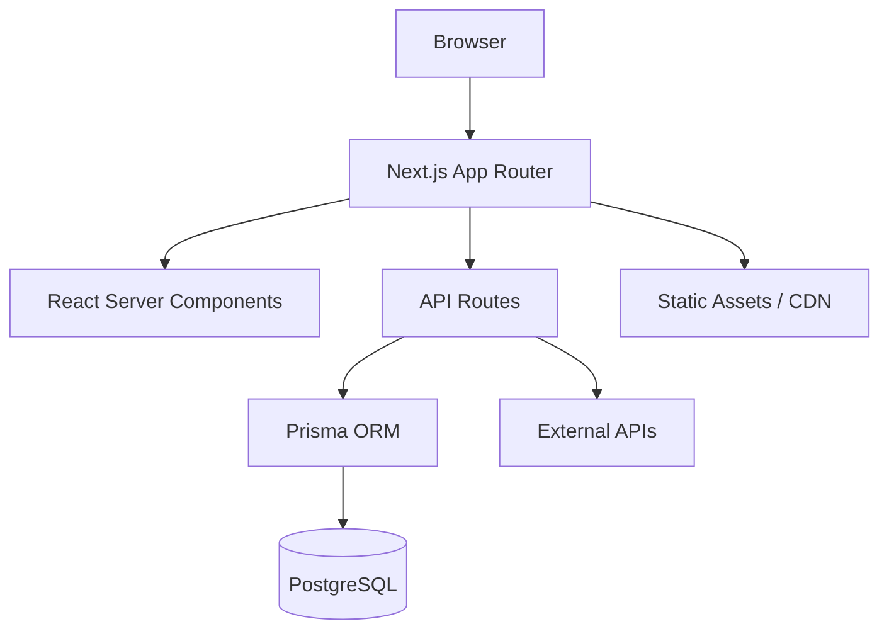

# Context Engineering - Customization Guide

This guide explains how to adapt the universal Context Engineering template to your specific project.

## Overview

The template uses `[[PLACEHOLDER]]` syntax throughout. Your job is to replace these with your project-specific values.

## Core File Customization

### CLAUDE.md - Global Conventions

This is your project's "rulebook" for AI. Be **specific**, not vague.

#### ❌ Bad (Vague)
```markdown
## Tech Stack Patterns

**React:**
- Use best practices
- Follow React guidelines
```

#### ✅ Good (Specific)
```markdown
## Tech Stack Patterns

**React + TypeScript:**
- Use functional components with hooks (no class components)
- Props must be typed: `interface ButtonProps { onClick: () => void }`
- Hooks order: useState, useEffect, useRef, custom hooks
- See `examples/components/` for component structure

**Example:**
```typescript
interface CardProps {
  title: string
  children: React.ReactNode
}

export function Card({ title, children }: CardProps) {
  return (
    <div className="card">
      <h2>{title}</h2>
      {children}
    </div>
  )
}
```
```

### Key Sections to Customize

**1. Project Awareness**

Tell AI what to check BEFORE starting:
```markdown
## Project Awareness

**Before starting ANY work:**
- Review `examples/` folder for established patterns
- Consult API spec in `docs/api/openapi.json`
- Check Storybook for UI components
- Verify environment variables in `.env.example`
```

**2. Tech Stack Patterns**

For EACH major library, document:
- When to use it
- How to use it (with code example)
- Common gotchas

**Example (Redux Toolkit):**
```markdown
**Redux Toolkit:**
- Use for global app state (auth, theme, etc.)
- NOT for server state (use React Query)
- Slice structure: state, reducers, selectors
- See `examples/state/user-slice.ts`

```typescript
import { createSlice } from '@reduxjs/toolkit'

const userSlice = createSlice({
  name: 'user',
  initialState: { name: '', email: '' },
  reducers: {
    setUser: (state, action) => action.payload,
  },
})
```

**Gotcha:** Don't mutate state directly outside reducers
**Gotcha:** Use `useAppSelector` instead of plain `useSelector` for types
```

**3. Validation Commands**

Match your package.json scripts:
```markdown
## Validation Commands (Must Pass Before Committing)

```bash
# Type check
npm run type-check  # or: tsc --noEmit

# Lint
npm run lint  # or: eslint . --ext ts,tsx

# Tests
npm test  # or: jest

# Build
npm run build  # or: next build
```
```

**4. Security Rules**

Project-specific security requirements:
```markdown
## Security Rules (CRITICAL)

**Authentication:**
- ✅ ALWAYS use NextAuth.js for auth
- ✅ ALWAYS store session in httpOnly cookie
- ❌ NEVER store tokens in localStorage
- ❌ NEVER trust client-side auth checks alone

**API Routes:**
- ✅ ALWAYS validate JWT token in middleware
- ✅ ALWAYS sanitize inputs with Zod
- ✅ ALWAYS use CSRF protection for mutations
```

**5. Critical Gotchas**

Document what trips people up:
```markdown
## Critical Gotchas

**Next.js 14 App Router:**
- Server Components are default (no useState/useEffect)
- Need 'use client' for client hooks
- Metadata export for SEO (no <Head>)
- Route groups use (parentheses) - don't affect URL

**Prisma:**
- Always use transactions for multi-table updates
- Remember to `prisma generate` after schema changes
- BigInt fields return as string (not number)
- Soft deletes: use deletedAt field, filter in queries
```

---

## PLANNING.md - Architecture

### Project Goal

One sentence that captures WHAT and WHY:

**Examples:**
- "Build a real-time collaborative whiteboard for remote teams to replace physical whiteboards."
- "Create an AI-powered email client that automatically categorizes and prioritizes emails."
- "Develop a fitness tracking app with social features to motivate consistent workouts."

### Feature Hierarchy

Use percentages to show priority:

```markdown
## Feature Hierarchy (Priority Order)

1. **PRIMARY**: User Management (40% of effort)
   - Registration and login
   - Profile management
   - Password reset

2. **SECONDARY**: Content Features (40% of effort)
   - Create, edit, delete posts
   - Comments and likes
   - Search and filtering

3. **TERTIARY**: Admin Dashboard (20% of effort)
   - User moderation
   - Analytics
   - Content reports
```

### System Architecture

Use Mermaid for visual architecture:



### Tech Stack Rationale

For EVERY technology, explain WHY:

```markdown
| Technology | Why |
|------------|-----|
| Next.js 14 | App Router for RSC, built-in API routes, image optimization |
| PostgreSQL | Relational data model, strong consistency, mature tooling |
| Prisma | Type-safe ORM, great DX, automatic migrations |
| Tailwind | Utility-first CSS, faster than writing custom CSS |
| Vercel | Zero-config deployment, edge functions, analytics |
```

---

## Examples Directory

### Strategy: Real Code, Not Tutorials

**❌ Don't:**
- Copy generic tutorials from the internet
- Create fake/hypothetical examples
- Use simplified code that doesn't match your real patterns

**✅ Do:**
- Extract real patterns from your actual codebase
- Include all necessary imports and types
- Add comments explaining WHY and gotchas
- Keep examples focused (one pattern per file)

### Universal Patterns (Included in Template)

The template includes these universal patterns that work across most tech stacks:

**Security (`examples/security/`):**
- `token-manager.ts` - Auth token handling (customize for your auth flow)
- `audit-logger.ts` - Security event logging (customize endpoints)

**Offline (`examples/offline/`):**
- `mutation-queue.ts` - Offline mutation queue (universal pattern)

**Testing (`examples/testing/`):**
- `component.test.tsx` - Component test structure (adapt to your testing library)
- `hook.test.ts` - Function/hook test structure (adapt to your testing library)

**Customize these** by replacing `[[PLACEHOLDERS]]` with your actual values.

---

### Framework-Specific Patterns (You Create)

You should create examples for YOUR specific tech stack:

**For Web Projects (React/Next.js/Vue/etc.):**
- API client setup (axios, fetch, tRPC)
- Data fetching hooks (React Query, SWR, Apollo)
- State management (Redux, Zustand, Context)
- Component patterns (your UI library)

**For Mobile Projects (React Native/Flutter/etc.):**
- API client with platform-specific storage
- Navigation patterns
- Platform-specific components
- State persistence

**For Backend Projects (Node/Python/etc.):**
- Request/response middleware
- Database query patterns
- Service layer patterns
- Error handling

**General Structure:**
```
examples/
├── integrations/        # Your API client patterns
├── data/               # Your data fetching patterns
├── state/              # Your state management patterns
├── components/         # Your UI component patterns (if applicable)
├── security/           # ✅ Already included (customize)
├── offline/            # ✅ Already included (customize)
└── testing/            # ✅ Already included (customize)
```

---

## Library Documentation (`PRPs/ai_docs/`)

Document the 5-7 libraries you use most frequently.

### Documentation Template

```markdown
# [Library Name]

## Overview
[2-3 sentence description]
[Key use cases in YOUR project]

## Setup
```[language]
// Installation and configuration code
```

## Common Patterns

### Pattern 1: [Name]
**When to use:** [Description]
```[language]
// Complete working example
```

### Pattern 2: [Name]
**When to use:** [Description]
```[language]
// Complete working example
```

## Gotchas
❌ **DON'T**: [Bad practice]
✅ **DO**: [Good practice]

❌ **DON'T**: [Another bad practice]
✅ **DO**: [Another good practice]

## Best Practices
- [Tip 1]
- [Tip 2]
- [Tip 3]

## Links
- [Official docs](URL)
- [Your internal guide](URL)
```

### Libraries to Document

**Web Projects:**
- Framework (React, Vue, Angular)
- Data fetching (React Query, SWR, Apollo)
- State management (Redux, Zustand, Recoil)
- UI library (Material-UI, Chakra, Radix)
- Form handling (React Hook Form, Formik)

**Backend Projects:**
- Web framework (Express, FastAPI, Django)
- ORM (Prisma, Sequelize, SQLAlchemy)
- Validation (Zod, Joi, Pydantic)
- Auth library (NextAuth, Passport, Auth0)

---

## API Specification (Optional but Recommended)

If you have an API:

### Step 1: Add API Spec

Place OpenAPI/Swagger spec in `docs/api/`:
```
docs/api/openapi.json  # or openapi.yaml
```

### Step 2: Create AI Summary

Create `PRPs/ai_docs/api-spec-summary.md`:

```markdown
# API Specification Summary

## Base URL
- **Development:** http://localhost:3000/api
- **Production:** https://api.yourapp.com

## Authentication
All endpoints require Bearer token in Authorization header:
```
Authorization: Bearer {token}
```

## Common Headers
- `Content-Type: application/json`
- `X-API-Version: 2.0`

## Endpoints

### Users
- `GET /users` - List users (paginated)
- `GET /users/:id` - Get user by ID
- `POST /users` - Create user
- `PUT /users/:id` - Update user
- `DELETE /users/:id` - Delete user

[Continue for all endpoint groups...]

## Request/Response Schemas

### User
```json
{
  "id": "string (UUID)",
  "email": "string",
  "name": "string",
  "createdAt": "ISO 8601 date"
}
```

[Continue for all schemas...]
```

### Step 3: Reference in CLAUDE.md

```markdown
## Security Rules (CRITICAL)

**API Implementation:**
- ✅ ALWAYS verify endpoints against `docs/api/openapi.json`
- ✅ ALWAYS match request/response schemas from spec
- 📄 API summary: `PRPs/ai_docs/api-spec-summary.md`
```

---

## Slash Commands (Rarely Need Changes)

The 12 slash commands in `.claude/commands/` are mostly universal. Only update:

**1. `generate-prp.md` and `execute-prp.md`**

If you have an API spec, commands reference it:
```markdown
- Verify all API endpoints against `docs/api/openapi.json`
```

Update these file paths to match your spec location.

**2. Validation Commands**

In `execute-prp.md`, update validation commands:
```markdown
```bash
npm run type-check  # Change to your command
npm run lint
npm test
```
```

---

## Advanced Customization

### Domain-Specific Color System

If you have design tokens:

```markdown
## Style & Formatting

**Design Tokens:**
- Primary: `$brand-blue` (#0066CC)
- Success: `$status-success` (#00CC66)
- Error: `$status-error` (#CC0000)
- Neutral: `$gray-100` through `$gray-900`

**Usage:**
```typescript
<Button bg="$brand-blue" /> // Use tokens
<Button bg="#0066CC" />      // ❌ Never hardcode
```
```

### Domain Models

Document your domain concepts:

```markdown
## Domain Models

**Reservation:**
- Represents a booking of a resource (court, room, equipment)
- Can have multiple participants
- Has status: pending, confirmed, cancelled
- Must validate capacity constraints

**Session:**
- Group fitness class or training session
- Has instructor, venue, time, max capacity
- Can have waitlist if full
- Auto-confirms bookings
```

---

## Validation Checklist

Before considering customization complete:

- [ ] All `[[PLACEHOLDERS]]` in CLAUDE.md replaced
- [ ] All `[[PLACEHOLDERS]]` in PLANNING.md replaced
- [ ] At least 5 working examples in `examples/`
- [ ] Validation commands tested and working
- [ ] Security rules defined clearly
- [ ] 5+ critical gotchas documented
- [ ] Tech stack rationale provided for each library
- [ ] At least 3 library docs in `PRPs/ai_docs/`
- [ ] API spec added (if applicable)
- [ ] Test feature request generates confidence ≥ 7

---

## Common Mistakes

### 1. Too Generic

**Problem:** "Use React best practices"

**Solution:** "Use functional components with TypeScript. Props typed as interfaces. Max 200 lines per component. See `examples/components/Button.tsx`"

### 2. No Working Examples

**Problem:** Only descriptions, no code

**Solution:** Add real, working code files to `examples/`

### 3. Missing Gotchas

**Problem:** No gotchas documented

**Solution:** Document things that tripped YOU up during development

### 4. Stale Documentation

**Problem:** Docs don't match current code

**Solution:** Update CLAUDE.md whenever patterns change

---

## Getting Help

If you're stuck:

1. **Review the Reusability Guide:** `docs/CONTEXT_ENGINEERING_REUSABILITY_GUIDE.md` has detailed explanations
2. **Check confidence scores:** Low scores (<7) indicate missing context
3. **Ask Claude:** Generate a PRP for a simple feature, see what it asks
4. **Iterate:** Update docs based on AI questions

---

**Next:** Run `/prime-core` and test with a simple feature request!
