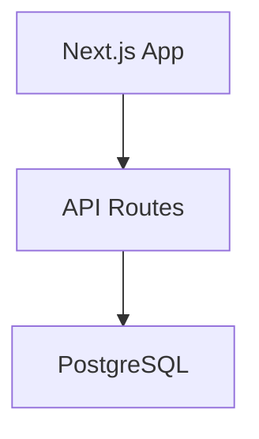

# Context Engineering - Setup Guide

Complete guide to setting up and customizing Context Engineering for your project.

**Time Required:** 2-4 hours for full setup

## Table of Contents

1. [Prerequisites](#prerequisites)
2. [Quick Setup (30 minutes)](#quick-setup)
3. [Customize CLAUDE.md](#customize-claudemd)
4. [Customize PLANNING.md](#customize-planningmd)
5. [Create Examples](#create-examples)
6. [Test Your Setup](#test-your-setup)
7. [Troubleshooting](#troubleshooting)

---

## Prerequisites

- Claude Code CLI installed
- Git repository initialized
- Basic understanding of your project's tech stack

---

## Quick Setup

### Step 1: Install and Initialize

**Option A: Using the CLI (Recommended)**

```bash
# Install uv (if you don't have it)
# Windows (PowerShell): irm https://astral.sh/uv/install.ps1 | iex
# macOS/Linux: curl -LsSf https://astral.sh/uv/install.sh | sh

# Install echograph CLI
uv tool install echograph

# Initialize in your project
cd your-project
echograph init

# Verify setup
echograph doctor
```

**Alternative:** `pip install echograph` (may require PATH configuration on Windows)

**Option B: Manual Setup**

```bash
# Clone this template
git clone <template-repo-url> my-project-context
cd my-project-context

# Copy into existing project
cp -r ContextEngineering/.claude /path/to/your-project/
cp -r ContextEngineering/PRPs /path/to/your-project/
cp -r ContextEngineering/examples /path/to/your-project/
```

### Step 2: Verify Directory Structure

```
your-project/
├── .claude/
│   ├── CLAUDE.md          # Global conventions (customize this)
│   ├── PLANNING.md        # Architecture (customize this)
│   ├── TASK.md            # Task tracking
│   ├── SPEC.md            # Feature request template
│   └── commands/          # Slash commands (25 files)
├── PRPs/
│   ├── templates/         # PRP templates
│   ├── ai_docs/           # Library documentation
│   └── feature-requests/  # Your feature requests
└── examples/              # Code patterns
```

---

## Customize CLAUDE.md

`.claude/CLAUDE.md` is the **most critical file**. It defines your project's conventions for AI.

### Replace Placeholders

The template uses `[[PLACEHOLDER]]` syntax. Replace ALL placeholders with your values:

```markdown
# [[PROJECT_NAME]] - Global Conventions
```
becomes:
```markdown
# MyApp - Global Conventions
```

### Key Sections to Customize

#### 1. Tech Stack Patterns

Be **specific**, not vague:

**Bad (Vague):**
```markdown
**React:**
- Use best practices
```

**Good (Specific):**
```markdown
**React + TypeScript:**
- Use functional components with hooks (no class components)
- Props must be typed: `interface ButtonProps { onClick: () => void }`
- See `examples/components/` for structure

**Example:**
```typescript
interface CardProps {
  title: string
  children: React.ReactNode
}

export function Card({ title, children }: CardProps) {
  return <div className="card"><h2>{title}</h2>{children}</div>
}
```
```

#### 2. Validation Commands

Match your actual package.json scripts:

```markdown
## Validation Commands (Must Pass Before Committing)

```bash
npm run type-check  # Type checking
npm run lint        # Linting
npm test            # Unit tests
npm run build       # Build verification
```
```

#### 3. Security Rules

Define your security requirements:

```markdown
## Security Rules (CRITICAL)

**Authentication:**
- ALWAYS use secure token storage (not localStorage)
- ALWAYS validate tokens server-side
- NEVER trust client-side auth alone

**API Calls:**
- ALWAYS use centralized API client
- ALWAYS handle 401 errors (redirect to login)
- ALWAYS validate inputs
```

#### 4. Critical Gotchas

Document things that trip people up:

```markdown
## Critical Gotchas

**Next.js 14:**
- Server Components are default (no useState/useEffect)
- Client hooks require 'use client' directive
- Image component requires width/height or fill prop

**TypeScript:**
- Strict mode enabled - no implicit any
- Avoid type assertions (as) - use type guards
```

---

## Customize PLANNING.md

`.claude/PLANNING.md` describes your project's architecture and goals.

### Project Goal

One clear sentence:

```markdown
## Project Goal

Build a task management web app with real-time collaboration and offline support.
```

### Feature Hierarchy

Prioritize with percentages:

```markdown
## Feature Hierarchy (Priority Order)

1. **PRIMARY**: Task Management (60% of effort)
   - Create, edit, delete tasks
   - Task lists and filtering

2. **SECONDARY**: Collaboration (30% of effort)
   - Share lists with team
   - Real-time updates

3. **TERTIARY**: AI Suggestions (10% - OPTIONAL)
   - Task time estimates
```

### System Architecture

Use Mermaid diagrams:

```markdown
## System Architecture


```

### Tech Stack Rationale

Justify every technology choice:

```markdown
| Technology | Why |
|------------|-----|
| Next.js 14 | App Router for RSC, built-in API routes |
| PostgreSQL | Relational data, ACID compliance |
| Tailwind | Utility-first, fast iteration |
```

---

## Create Examples

Examples are **CRITICAL**. AI learns from working code, not descriptions.

### Create Your Own Examples

Add examples for YOUR tech stack in the `examples/` directory:

```
examples/
├── integrations/    # Your API client patterns
├── data/            # Your data fetching patterns
├── state/           # Your state management patterns
├── components/      # Your UI patterns (optional)
├── security/        # Auth patterns
├── offline/         # Offline-first patterns
└── testing/         # Test patterns
```

**Tips:**
- Use REAL code from your project
- Add comments explaining WHY and gotchas
- Keep one pattern per file
- Ensure examples actually work

---

## Test Your Setup

### Step 1: Load Context

```bash
/prime-core
```

Verify Claude loads without errors.

### Step 2: Create Test Feature Request

Create `PRPs/feature-requests/test-feature-SPEC.md`:

```markdown
## FEATURE
Add a simple login form with email and password fields.

## EXAMPLES
Standard login form with validation errors shown inline.

## DOCUMENTATION
- Related patterns: examples/components/

## OTHER CONSIDERATIONS
- Must validate email format
- See CLAUDE.md Security Rules
```

### Step 3: Generate PRP

```bash
/generate-prp PRPs/feature-requests/test-feature-SPEC.md
```

**Check:**
- Confidence score >= 7
- References to `examples/`
- Correct validation commands

### Step 4: Iterate

If confidence < 7:
- Add more examples
- Clarify gotchas in CLAUDE.md
- Add library documentation to `PRPs/ai_docs/`

---

## Troubleshooting

### Low Confidence Scores

**Problem:** Generated PRPs have confidence < 7

**Solutions:**
- Add more examples to `examples/`
- Document patterns in CLAUDE.md
- Add library docs to `PRPs/ai_docs/`

### Many Clarifying Questions

**Problem:** AI asks 5+ questions per PRP

**Solutions:**
- Make CLAUDE.md more specific
- Add real code examples
- Document edge cases and gotchas

### Validation Failures

**Problem:** Generated code doesn't pass tests

**Solutions:**
- Verify validation commands match your project
- Check examples/ code is valid
- Update CLAUDE.md patterns

### AI Doesn't Follow Patterns

**Problem:** Generated code doesn't match your style

**Solutions:**
- Add more examples to `examples/`
- Reference examples explicitly in CLAUDE.md
- Add "Before starting ANY work" checklist

---

## Success Criteria

You've successfully set up Context Engineering when:

- [ ] `/prime-core` loads without errors
- [ ] Generated PRPs have confidence >= 7
- [ ] AI asks < 2 clarifying questions
- [ ] Validation commands pass on generated code
- [ ] AI follows your established patterns

---

## Next Steps

1. Run `/prime-core` to load context
2. Create a simple feature request
3. Generate and execute your first PRP
4. Iterate based on results

See [WORKFLOW_GUIDE.md](WORKFLOW_GUIDE.md) for the feature development workflow.
