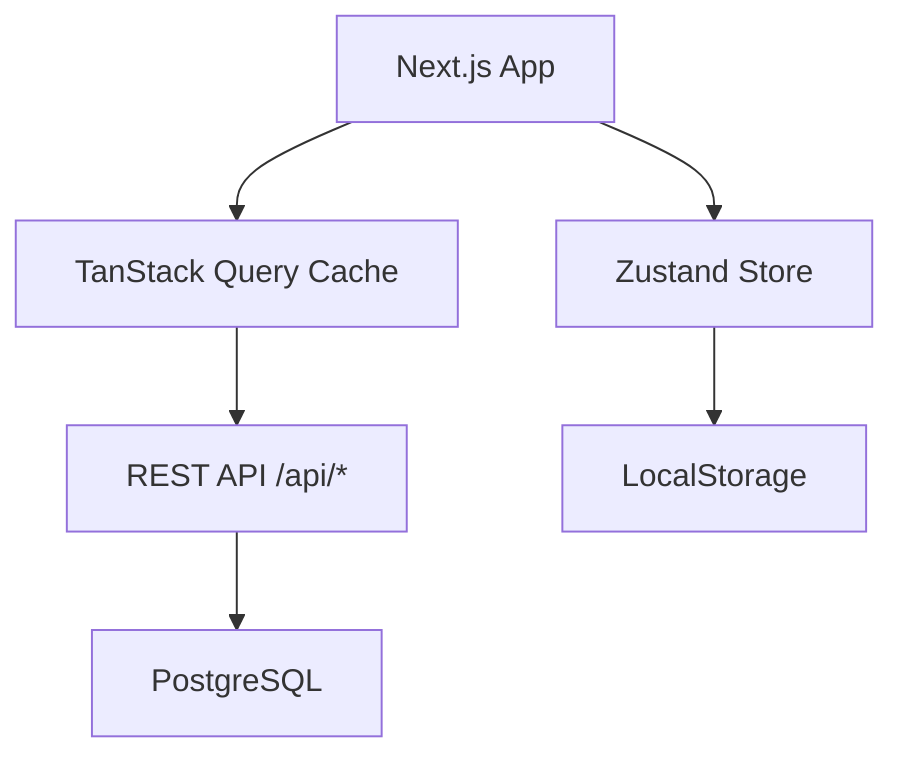

# Context Engineering - Setup Guide

This guide will walk you through setting up the Context Engineering system for your project in **~2-4 hours**.

## Prerequisites

- Claude Code CLI installed
- Git repository initialized
- Basic understanding of your project's tech stack

## Phase 1: Initial Setup (30 minutes)

### Step 1.1: Copy Template Files

If you haven't already, copy all files from this template to your project:

```bash
# Option A: Clone this template
git clone <template-repo-url> my-project-context
cd my-project-context

# Option B: Copy into existing project
cp -r ContextEngineering/.claude /path/to/your-project/
cp -r ContextEngineering/PRPs /path/to/your-project/
cp -r ContextEngineering/examples /path/to/your-project/
cp -r ContextEngineering/docs /path/to/your-project/
```

### Step 1.2: Verify Directory Structure

Ensure you have:
```
your-project/
├── .claude/
│   ├── CLAUDE.md
│   ├── PLANNING.md
│   ├── TASK.md
│   ├── INITIAL.md
│   ├── settings.local.json
│   └── commands/ (12 files)
├── PRPs/
│   ├── ai_docs/
│   ├── templates/
│   ├── scripts/
│   └── completed/
├── examples/
│   ├── integrations/
│   ├── hooks/
│   ├── state/
│   ├── security/
│   ├── offline/
│   └── testing/
└── docs/
    ├── SETUP_GUIDE.md
    ├── CUSTOMIZATION_GUIDE.md
    └── CONTEXT_ENGINEERING_REUSABILITY_GUIDE.md
```

---

## Phase 2: Customize CLAUDE.md (1-2 hours)

`.claude/CLAUDE.md` is the **most critical file**. This defines your project's conventions.

### Step 2.1: Project Information

Replace placeholders at the top:
```markdown
# [[PROJECT_NAME]] - Global Conventions
```
→
```markdown
# MyApp - Global Conventions
```

### Step 2.2: Tech Stack Patterns

Fill in your technology stack. For each library/framework:

**Example - React with TypeScript:**
```markdown
## Tech Stack Patterns

**React + TypeScript:**
- Use functional components with hooks (no class components)
- Props interfaces must be exported: `export interface ButtonProps {}`
- Use `React.FC` sparingly (prefer explicit types)

**TanStack Query (React Query):**
- Query keys: `['resource', id, ...filters]` format
- Stale time: 5 minutes for user data, 1 minute for real-time data
- See `examples/hooks/use-fetch-list.ts` for pattern

**Tailwind CSS:**
- Use utility classes, avoid inline styles
- Custom colors defined in `tailwind.config.js`
- Responsive: mobile-first (sm:, md:, lg:)
```

### Step 2.3: Code Structure

Define your file organization:
```markdown
## Code Structure

**File Organization:**
- Keep files under 300 lines; split when exceeded
- Feature-based structure: `src/features/{feature-name}/`
- Each feature contains: `components/`, `hooks/`, `utils/`, `types.ts`
```

### Step 2.4: Validation Commands

**CRITICAL**: Define commands that must pass before committing:

```markdown
## Validation Commands (Must Pass Before Committing)

```bash
# Type check (must exit 0)
npm run type-check

# Lint check (must exit 0)
npm run lint

# Unit tests (must pass)
npm test

# Build check (must succeed)
npm run build
```
```

These will be run by `/execute-prp` at each step.

### Step 2.5: Security Rules

Define your security requirements:

```markdown
## Security Rules (CRITICAL)

**API Calls:**
- ✅ ALWAYS use centralized API client (`lib/api/client.ts`)
- ✅ ALWAYS include CSRF token for mutations
- ✅ ALWAYS validate inputs with Zod schemas
- ❌ NEVER trust client-side validation alone
```

### Step 2.6: Critical Gotchas

Document things that trip people up:

```markdown
## Critical Gotchas

**Next.js:**
- Server Components are default in App Router
- Client hooks (useState, useEffect) require 'use client' directive
- Image component requires width/height or fill prop

**TypeScript:**
- Strict mode enabled - no implicit any
- Avoid type assertions (as) - use type guards instead
```

---

## Phase 3: Customize PLANNING.md (30-60 minutes)

`.claude/PLANNING.md` describes your project's architecture and goals.

### Step 3.1: Project Goal

One clear sentence:
```markdown
## Project Goal

Build a task management web app with real-time collaboration, offline support, and AI-powered task suggestions.
```

### Step 3.2: Feature Hierarchy

Prioritize your features:
```markdown
## Feature Hierarchy (Priority Order)

1. **PRIMARY**: Task Management (60% of effort)
   - Create, edit, delete tasks
   - Task lists and filtering
   - Due dates and priorities

2. **SECONDARY**: Collaboration (30% of effort)
   - Share lists with team members
   - Real-time updates
   - Comments and mentions

3. **TERTIARY**: AI Suggestions (10% of effort - OPTIONAL)
   - Task time estimates
   - Priority recommendations
```

### Step 3.3: System Architecture

Add a Mermaid diagram:
```markdown
## System Architecture


```

### Step 3.4: Tech Stack Rationale

Justify every technology choice:
```markdown
## Tech Stack Rationale

| Technology | Why |
|------------|-----|
| Next.js 14 | App Router for RSC, API routes, TypeScript support |
| TanStack Query | Best caching, optimistic updates, devtools |
| PostgreSQL | Relational data, ACID compliance, robust |
| Tailwind CSS | Utility-first, fast iteration, small bundle |
```

---

## Phase 4: Create Examples (2-4 hours)

Examples are **CRITICAL**. AI learns from working code, not descriptions.

### Universal Examples (Already Included)

The template includes truly universal patterns:
- `examples/security/token-manager.ts` - Auth token management
- `examples/security/audit-logger.ts` - Security event logging
- `examples/offline/mutation-queue.ts` - Offline mutation queue
- `examples/testing/component.test.tsx` - Component test structure
- `examples/testing/hook.test.ts` - Hook/function test structure

You can customize these by replacing `[[PLACEHOLDERS]]` with your specific values.

### Framework-Specific Examples (You Need to Create)

Create examples for YOUR tech stack. Recommended categories:

#### 1. API Integration (`examples/integrations/`)
Create your own based on your HTTP client:
- API client setup (axios, fetch, etc.)
- Request/response interceptors
- Error handling patterns

#### 2. Data Fetching (`examples/data/` or `examples/hooks/`)
Based on your data fetching approach:
- Query patterns (React Query, SWR, Apollo, etc.)
- Mutation patterns
- Cache management

#### 3. State Management (`examples/state/`)
Based on your state solution:
- Global state setup (Redux, Zustand, Context, etc.)
- State update patterns
- Persistence strategy

#### 4. UI Components (`examples/components/`) - Optional
If you have established component patterns:
- Common component structures
- Props patterns
- Composition examples

**Important:** Use REAL code from your project, not generic tutorials

### Customization Tips

- **Use real code from your project** (not made-up examples)
- **Add generous comments** explaining WHY and gotchas
- **Keep one pattern per file** (focused examples)
- **Ensure all examples work** (no broken code)

---

## Phase 5: Update TASK.md (5 minutes)

The Context Engineering framework uses a **three-level hierarchical task system**:

1. **Master TASK.md** - High-level features with task IDs
2. **Feature Task Files** (`.claude/tasks/`) - Detailed subtasks
3. **TodoWrite** - Session-level granular tasks (managed by Claude)

### Update Master TASK.md

Replace example tasks with your actual project tasks:

```markdown
# Current Tasks

## In Progress
- [ ] [TASK-001] Set up authentication flow (2/5) → @.claude/tasks/TASK-001-auth-flow.md

## Pending
- [ ] [TASK-002] Build task list UI → @.claude/tasks/TASK-002-task-ui.md
- [ ] [TASK-003] Implement real-time sync → @.claude/tasks/TASK-003-realtime.md

## Completed
_Tasks move here automatically when all subtasks done_

---

**Last Updated**: 2025-01-15
```

### Create Feature Task Files

For each high-level task, create a feature task file in `.claude/tasks/`:

**Example**: `.claude/tasks/TASK-001-auth-flow.md`
```markdown
# [TASK-001] Set up Authentication Flow

**Status**: In Progress
**Started**: 2025-01-15

## Context
Implement OAuth 2.0 authentication with token refresh.

## Subtasks
- [x] [TASK-001.1] Create auth service structure
- [x] [TASK-001.2] Implement login endpoint
- [ ] [TASK-001.3] Add token refresh logic
- [ ] [TASK-001.4] Add logout functionality
- [ ] [TASK-001.5] Write auth tests

**Completion**: 2/5 subtasks complete (40%)

**Last Updated**: 2025-01-15
```

**See**: `.claude/tasks/README.md` for full documentation

---

## Phase 6: Test the System (30 minutes)

### Step 6.1: Load Context

```bash
/prime-core
```

Verify Claude loads all context without errors.

### Step 6.2: Create Test Feature Request

Fill out `.claude/INITIAL.md`:

```markdown
## FEATURE
Add a simple login form with email and password fields.

## EXAMPLES
Standard login form with email input, password input, submit button.
Show validation errors inline.

## DOCUMENTATION
- Auth library: docs for your auth solution
- Form handling: React Hook Form docs
- Related patterns: examples/integrations/axios-client.ts

## OTHER CONSIDERATIONS
- Must validate email format
- Must hash password before sending
- Must store JWT token securely
- See CLAUDE.md Security Rules section
```

### Step 6.3: Generate PRP

```bash
/generate-prp .claude/INITIAL.md
```

**Check:**
- Confidence score ≥ 7
- References to `examples/`
- Correct validation commands
- No clarification questions (or only 1-2)

**If confidence < 7:**
- Add more examples
- Clarify gotchas in CLAUDE.md
- Add missing library documentation

### Step 6.4: Execute PRP (Optional)

```bash
/execute-prp PRPs/login-form.md
```

Watch AI execute step-by-step. Verify:
- Validation gates work
- AI follows your patterns
- Code quality is good

---

## Phase 7: Iterate (Ongoing)

As you use the system:

**Update CLAUDE.md when:**
- You discover a new gotcha
- Pattern changes
- New library added

**Update examples/ when:**
- Better pattern emerges
- New feature type introduced

**Update PLANNING.md when:**
- Architecture evolves
- Priorities change

---

## Success Criteria

You've successfully set up Context Engineering when:

- [ ] `/prime-core` loads without errors
- [ ] Generated PRPs have confidence ≥ 7
- [ ] AI asks < 2 clarifying questions
- [ ] Validation commands pass on generated code
- [ ] AI follows your established patterns
- [ ] First-pass success rate > 70%

---

## Troubleshooting

### Low Confidence Scores

**Problem**: Generated PRPs have confidence < 7

**Solutions:**
- Add more examples in `examples/`
- Clarify requirements in CLAUDE.md
- Document library patterns in `PRPs/ai_docs/`
- Add API spec to `docs/api/`

### Many Clarifying Questions

**Problem**: AI asks 5+ questions per PRP

**Solutions:**
- Make CLAUDE.md more specific (replace vague with concrete)
- Add real code examples (not descriptions)
- Document edge cases and gotchas

### Validation Failures

**Problem**: Generated code doesn't pass validation

**Solutions:**
- Verify validation commands in CLAUDE.md are correct
- Check examples/ code is valid
- Update patterns in CLAUDE.md to match current best practices

### AI Doesn't Follow Patterns

**Problem**: Generated code doesn't match examples/

**Solutions:**
- Make examples more prominent in CLAUDE.md
- Add "Before starting ANY work" section with explicit pattern checking
- Reference examples/ in PRP templates

---

## Next Steps

1. **Complete customization** of CLAUDE.md, PLANNING.md, examples/
2. **Execute 2-3 small PRPs** to build confidence
3. **Refine based on results** (update gotchas, add examples)
4. **Scale up** to medium and large features
5. **Onboard teammates** using `/onboarding` command

See [CUSTOMIZATION_GUIDE.md](CUSTOMIZATION_GUIDE.md) for detailed customization instructions.
