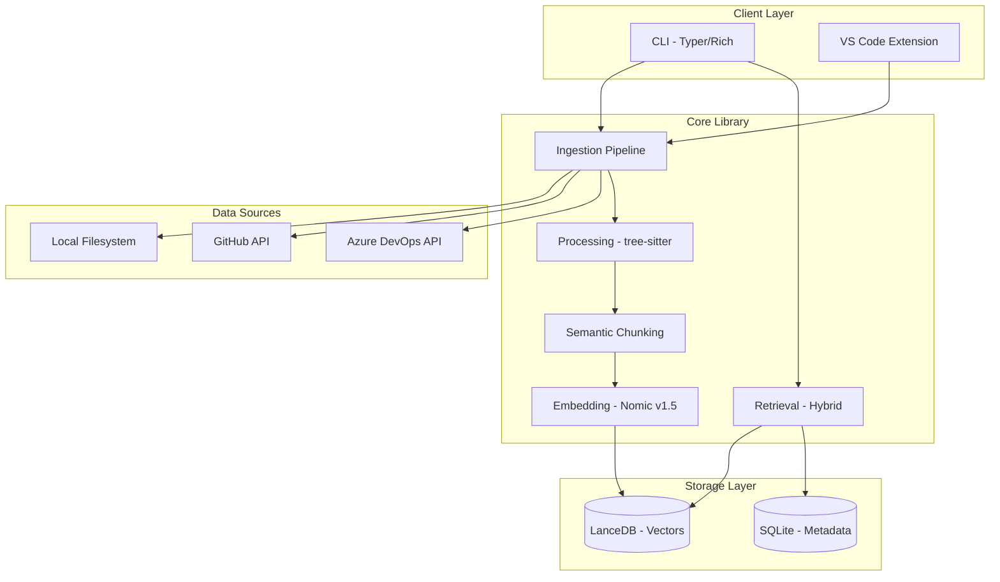

# EchoGraph - Architecture & Goals

## Project Goal

Build an open-source AI-powered context graph that helps engineering teams capture, connect, and retrieve knowledge across their development workflow - your team's engineering memory system.

## Target Users

- **Solo Developers**: Want to search their codebase semantically and track architectural decisions
- **Small Teams (2-10)**: Need shared context across code, PRs, issues, and discussions
- **Enterprise Teams**: Require self-hosted solution with Azure DevOps integration and security compliance

## Feature Hierarchy (Priority Order)

1. **PRIMARY**: Context Engineering CLI (40% of Phase 0 effort)
   - `echograph init` - scaffold .claude/ directory with templates
   - `echograph update` - update templates preserving customizations
   - `echograph validate` - check context files for completeness
   - `echograph doctor` - verify Claude Code setup

2. **PRIMARY**: Search Infrastructure (40% of Phase 1 effort)
   - Local file ingestion with .gitignore respect
   - GitHub/Azure DevOps repository sync
   - Semantic code search with embeddings
   - Hybrid retrieval (vector + BM25S keyword search)

3. **SECONDARY**: Decision Tracking (20% of Phase 1 effort)
   - Decision record CRUD operations
   - Linking decisions to code/PRs/commits
   - Decision search and discovery

4. **TERTIARY**: Team Features (Phase 2 - FUTURE)
   - Docker Compose deployment with Qdrant
   - Multi-user authentication
   - Slack integration

## System Architecture



## Data Flow

1. **Ingestion** → Files fetched from sources (filesystem, GitHub, Azure DevOps)
2. **Processing** → Code parsed with tree-sitter, structure extracted
3. **Chunking** → Content split at semantic boundaries (functions, classes, headings)
4. **Embedding** → Chunks embedded with Nomic Embed Text v1.5 (768 dimensions)
5. **Storage** → Vectors stored in LanceDB, metadata in SQLite
6. **Retrieval** → Hybrid search combines vector similarity + BM25S keyword matching

## State Management Strategy

**Configuration (Pydantic Settings):**
- echograph.yaml per project
- Environment variable overrides (ECHOGRAPH_*)
- XDG-compliant global settings

**Data Storage (SQLite + LanceDB):**
- SQLite: Documents, Decisions, Sources, SyncHistory
- LanceDB: Vector embeddings with metadata
- File-based storage in ~/.echograph/ or .echograph/

## Tech Stack Rationale

| Technology | Why |
|------------|-----|
| **uv** | 10-30x faster than Poetry, native workspaces, built-in Python version management |
| **LanceDB** | File-based vectors, 25ms latency, production-proven (Netflix), no Docker needed |
| **Nomic Embed v1.5** | Apache 2.0, runs locally free, 8192 token context, beats OpenAI on MTEB |
| **Typer + Rich** | FastAPI of CLIs, type-hint driven, beautiful terminal output |
| **tree-sitter** | Fast incremental parsing, syntax-aware code understanding |
| **BM25S** | 500x faster than rank-bm25, Scipy sparse matrices |
| **PyJWT** | Active maintenance, better security than python-jose |
| **FastAPI** | Async-native, automatic OpenAPI, Pydantic integration |
| **SQLAlchemy 2.0** | Async support, type hints, mature ecosystem |

## Non-Functional Requirements

**Performance Targets:**
- Search latency: <100ms for typical queries
- Indexing speed: 1000 files/minute on modern laptop
- Embedding batch: ~50ms per batch of 32 chunks

**Storage Efficiency:**
- Chunk size: 512 tokens default with 50-100 token overlap
- Vector dimensions: 768 (Nomic Embed v1.5)
- Incremental sync: only process changed files

**Developer Experience:**
- Zero Docker requirement for local CLI usage
- Single `pip install echograph` to get started
- <5 seconds for `echograph init`

## Security Architecture

**Token Storage:**
- GitHub PAT stored in system keyring or environment variable
- Azure DevOps PAT with minimal required scopes
- Never stored in plain text config files

**Data Privacy:**
- All data stays local (file-based storage)
- No telemetry or external API calls except configured integrations
- Embeddings generated locally with sentence-transformers

**API Security (Server Mode):**
- JWT authentication with PyJWT
- CORS configuration for allowed origins
- Rate limiting on sync endpoints

## Package Structure

```
packages/
├── cli/           # echograph command - Typer CLI
├── core/          # Shared library - ingestion, processing, retrieval
├── api/           # FastAPI service - Docker mode
└── vscode-extension/  # VS Code integration
```

## Success Criteria (Phase 1 MVP)

- [ ] `pip install echograph` works from PyPI
- [ ] `echograph init` scaffolds .claude/ in <5 seconds
- [ ] `echograph sync local ./src` indexes local files
- [ ] `echograph sync github owner/repo` indexes GitHub repo
- [ ] `echograph search "authentication logic"` returns relevant results in <100ms
- [ ] `echograph decision create` allows tracking architectural decisions
- [ ] Works entirely offline after initial setup (no cloud dependencies)
- [ ] Documentation covers all commands and configuration options
